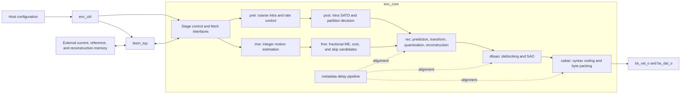

# H.265 Encoder RTL Specification

## 1. Document status

This document specifies the behavior implemented by the RTL integration top
`h265enc_top`. It is an **as-built implementation specification**, not a
replacement for the ITU-T H.265 or ISO/IEC 23008-2 standard.

| Item | Value |
|---|---|
| RTL top | `top/enc_top.v`, module `h265enc_top` |
| Source revision reviewed | `15d7754124d847adc1b3de43f12aee9278437e08` |
| Primary simulation environment | `../sim/top_testbench/` |
| Pixel organization | 8-bit YUV 4:2:0 |
| Coding structure | Host-selected I and P pictures |
| Output boundary | CABAC-coded slice payload bytes |

Where the README and the RTL differ in specificity, the RTL is authoritative.
Project performance claims are identified separately from behavior confirmed by
source inspection or simulation artifacts.

### 1.1 Normative language

`shall`, `must`, and `required` describe integration requirements needed to use
the current RTL safely. `supports` describes logic present in the reviewed
source. `claimed` describes a project statement that is not proven by the
available timing or conformance evidence.

### 1.2 Scope

This specification covers:

- implemented codec capabilities and known exclusions;
- top-level signals and configuration fields;
- frame, external-memory, and output-byte protocols;
- CTU pipeline architecture and processing blocks;
- input, reference, reconstruction, and payload formats;
- integration sequence, verification flow, and open interface gaps.

VPS, SPS, PPS, NAL-unit construction, Annex-B start codes, container muxing,
DPB policy, GOP policy, and host register-bus design are outside the RTL top and
are host responsibilities.

## 2. Implemented capability

### 2.1 Codec feature summary

| Capability | As-built status | Evidence or qualification |
|---|---|---|
| HEVC Main Profile target | Project target | Declared in `../README.md`; full conformance is not established by this repository. |
| Sample format | 8-bit YUV 4:2:0 | `PIXEL_WIDTH=8`; testbench stores one luma plane and half-height interleaved chroma. |
| Picture types | I and P | `sys_type_i` is one bit: `0=INTRA`, `1=INTER`. There is no B-picture control. |
| CTU size | 64x64 luma samples | `LCU_SIZE=64`. |
| CU quadtree | Inter: 64x64 down to 8x8; intra: 32x32 down to 8x8 | The integrated POSI decision always splits the 64x64 intra root. An inter CTU can retain a 64x64 CU. |
| Intra prediction | Planar, DC, and angular modes 2 through 33 | Mode-34 prediction datapath exists, but integrated PREI cannot select it. The build therefore selects 34 of the 35 HEVC luma modes. |
| Intra PU sizes | 4x4, 8x8, 16x16, 32x32 | 4x4 is available at the smallest intra CU; there is no selected 64x64 intra PU. |
| Chroma intra prediction | Derived from the selected luma mode | There is no independent chroma-mode decision; CABAC signals derived mode. |
| Inter partitions | Symmetric 2Nx2N, 2NxN, Nx2N | The fourth internal code denotes CU split. Asymmetric motion partitions are not exposed. |
| Motion estimation | Programmable integer search plus fractional refinement | Up to eight packed IME commands; FME refines candidates to quarter-luma-sample precision. |
| Reference pictures | One externally supplied reference picture per P picture | No reference-list index is present at the top-level interface. |
| Transform sizes | 4x4, 8x8, 16x16, 32x32 | The four datapaths exist, but the TU structure is fixed from CU depth/intra NxN structure rather than independently RDO-selected. |
| Quantization | Per-CTU QP with optional feedback and ROI adjustment | Six-bit QP datapath; integration shall constrain QP to the HEVC range used by the design. |
| Inter tools | Motion-vector prediction/difference and SKIP using merge candidates | The integrated CABAC merge flag is tied to skip; independent non-skip MERGE selection is not implemented. |
| Intra-in-P | Optional | Controlled by `sys_IinP_ena_i`. |
| Entropy coding | CABAC | Syntax preparation, binarization, context update, range/low update, and byte packing are present. |
| In-loop filtering | Deblocking end-to-end; SAO sample datapath only in this build | `sys_sao_ena_i` can modify stored samples, but `SAO_OPEN=0` compiles SAO syntax out of CABAC. |
| Partial edge CTUs | Implemented | Frame remainder information is supplied to mode decision, reconstruction, fetch, and CABAC. |
| Hardware CTU rate control | Implemented with caveats | Feedback and rectangular ROI QP adjustment are present; see Section 7. |
| Software frame rate control | External | The host supplies frame QP and rate-control coefficients. |
| 4K at 30 fps, 400 MHz | Project claim | Stated in `../README.md`; no timing constraints or synthesis report are included. |

### 2.2 Deliberate exclusions and unverified features

The current top-level design does not provide interfaces for:

- B pictures, bi-prediction, or multiple active reference indices;
- tiles, wavefront parallel processing, or multiple independently controlled
  slices;
- VPS/SPS/PPS, slice-header generation, NAL headers, start codes, SEI, or VUI;
- 10/12-bit samples or 4:2:2/4:4:4 chroma;
- output backpressure or an exposed final payload-drained indication;
- a standard APB, AHB, AXI, or streaming bus wrapper.
- independent chroma intra-mode selection or RDO-selected transform-tree
  structure.

Absence from this list does not prove standards conformance. A decoder
conformance campaign is required before claiming a conforming Main Profile
encoder product.

## 3. Picture and data conventions

### 3.1 Picture dimensions

`sys_all_x_i` and `sys_all_y_i` are active luma width and height in pixels. The
top converts them to inclusive last-CTU coordinates:

```text
last_ctu_x = ceil(width  / 64) - 1
last_ctu_y = ceil(height / 64) - 1
```

The internal CTU coordinates are six bits, so no picture may exceed 64 CTUs in
either direction. Although the width port is 13 bits, that port width does not
extend the internal CTU-coordinate capacity. With four-pixel alignment, the
representable upper bounds are 4096 pixels in width and 4092 pixels in height;
the 12-bit height port cannot represent 4096.

For this implementation:

- width and height shall be positive;
- width and height shall be multiples of four luma samples;
- width and height need not be multiples of 64;
- the 4:2:0 layout requires even chroma dimensions;
- the external responder shall service the complete descriptor requested by the
  RTL, including beats outside the active picture at right or bottom edges.

The RTL contains active-picture boundary masking and reference-edge extension,
but the external interface still requests fixed-size tiles/windows. The external
responder shall return deterministic values for every requested load beat. The
interface does not prescribe a padding value for inactive samples.

### 3.2 CTU order

CTUs are launched in raster scan. X increments first; at the inclusive final X,
X returns to zero and Y increments. The pipeline fills, processes concurrent
CTUs, and drains after the final input CTU.

### 3.3 External frame layout

The reference testbench models the following byte-addressed storage:

```text
luma_base   = 0
luma_addr   = y * picture_width + x
chroma_base = picture_width * picture_height
chroma_addr = chroma_base + chroma_y * picture_width + x
```

The chroma area uses interleaved `U,V,U,V,...` bytes with the same byte stride as
the luma width and half as many rows. Planar YUV input is converted to this
layout by the testbench. An NV12-style interleaved source can be loaded directly.

The equations above apply only to active coordinates. A fixed 64-byte edge
descriptor can contain coordinates outside the active width or height. The
responder shall bounds-check every sample: synthesize deterministic padding for
out-of-range loads and discard out-of-range stores. It shall not allow an
out-of-range X coordinate to wrap into the next active row. A physically padded
surface/stride is also valid if address translation preserves this behavior.

### 3.4 External beat byte order

Each external data beat contains 16 pixels:

```text
extif_data[127:120] = pixel[x + 0]
extif_data[119:112] = pixel[x + 1]
...
extif_data[7:0]     = pixel[x + 15]
```

Beats and rows are transferred in increasing raster order. The interface has no
per-beat address; the memory responder derives the address from the descriptor
and beat count.

## 4. Architecture

### 4.1 Top-level hierarchy



`h265enc_top` instantiates `enc_ctrl`, `fetch_top`, and `enc_core`.
`enc_core` instantiates buffered PREI, POSI, IME, and FME blocks followed by
reconstruction, DB/SAO, CABAC, and the metadata pipeline.

### 4.2 Pipeline schedule

`enc_ctrl` uses an 11-state fill/steady-state/drain controller. Every processing
stage receives a one-cycle `start` pulse and returns a `done` pulse. Done events
are retained until all active work for the current pipeline advance is complete.

For an I picture:

```text
fetch -> PREI -> POSI -> REC(intra + T/Q) -> DB/SAO -> CABAC
```

For a P picture:

```text
fetch -> [PREI || IME] -> [POSI || FME] -> REC(MC + T/Q, optional I-in-P)
      -> DB/SAO -> CABAC
```

PREI and IME are concurrent at the first decision stage. POSI and FME are
concurrent at the second decision stage. A P-picture stage does not advance
until both members of the relevant pair finish.

The metadata pipeline advances only on the aggregate CTU pipeline-advance
pulse. It aligns QP, intra/inter partition decisions, I-in-P selection, coded
block flags, skip flags/merge indices, and output-byte counts with later stages.

### 4.3 Processing block behavior

| Block | Required behavior |
|---|---|
| `fetch` | Sequence enabled external loads/stores, buffer current/reference samples, extend reference boundaries, and provide indexed sample reads to processing stages. |
| `prei` | Estimate/select intra modes for the 64/32/16/8 CU hierarchy, produce a complexity metric, and calculate the CTU QP. |
| `posi` | Evaluate the PREI-supplied intra mode using SATD plus estimated mode-rate cost, decide the intra split tree with a forced 64x64 root split, and store the selected mode. |
| `ime` | Execute the programmed integer-search commands, calculate SAD/MV costs, choose symmetric partitions, and write integer MVs. |
| `fme` | Form MV candidates, perform half/quarter-pel interpolation and SATD cost evaluation, refine MVs, generate prediction samples, and determine SKIP using merge candidates. |
| `rec` | Select intra or inter prediction, perform luma/chroma prediction, transform, quantization, inverse quantization/transform, reconstruction, CBF generation, and MVD generation. |
| `dbsao` | Derive boundaries and strengths, apply optional luma/chroma deblocking, and implement SAO statistics/offset/sample datapaths. SAO syntax is not consumed by CABAC in the reviewed build. |
| `cabac` | Prepare the enabled CU/TU/MV syntax, binarize, update contexts and arithmetic state, terminate the slice payload, and emit packed bytes. `SAO_OPEN=0` bypasses SAO syntax. |

## 5. Top-level interface

All signals are synchronous to `clk` unless explicitly identified as reset.
Widths below are resolved from the reviewed `enc_defines.v`.

### 5.1 Clock, reset, and frame control

| Signal | Dir. | Width | Meaning and requirement |
|---|---:|---:|---|
| `clk` | In | 1 | Rising-edge processing clock. |
| `rstn` | In | 1 | Asynchronous active-low reset. Assert until the clock is stable; synchronous deassertion is recommended. |
| `sys_start_i` | In | 1 | One-clock frame-start pulse accepted while idle. Starts while busy are not queued. |
| `sys_done_o` | Out | 1 | One-clock scheduler frame-completion pulse. It is not a guaranteed final-byte-drained marker. |
| `sys_type_i` | In | 1 | `0`: I picture; `1`: P picture. |
| `sys_all_x_i` | In | 13 | Active luma width in pixels. |
| `sys_all_y_i` | In | 12 | Active luma height in pixels. |
| `sys_init_qp_i` | In | 6 | Slice/frame base QP used by CABAC initialization, rate control, and IME MV-cost calculation. Constrain to `0..51`. |
| `sys_IinP_ena_i` | In | 1 | Enable intra-CU selection in a P picture. |
| `sys_db_ena_i` | In | 1 | Enable deblocking sample modification. |
| `sys_sao_ena_i` | In | 1 | Enable SAO decision and sample modification only; current CABAC syntax remains disabled by `SAO_OPEN=0`. |
| `sys_posi4x4bit_i` | In | 5 | POSI estimated bit count used for every 4x4 intra candidate before lambda scaling. |

All configuration inputs shall be valid before `sys_start_i` and remain stable
through `sys_done_o`, because the top does not latch a complete frame
configuration record.

### 5.2 Skip thresholds

| Signal | Dir. | Width | Meaning |
|---|---:|---:|---|
| `skip_cost_thresh_08` | In | 32 | Skip decision cost threshold for 8x8 CU processing. |
| `skip_cost_thresh_16` | In | 32 | Skip decision cost threshold for 16x16 CU processing. |
| `skip_cost_thresh_32` | In | 32 | Skip decision cost threshold for 32x32 CU processing. |
| `skip_cost_thresh_64` | In | 32 | Skip decision cost threshold for 64x64 CU processing. |

The thresholds feed FME skip logic directly. Their useful scale depends on QP,
lambda, and the selected cost model. The default testbench programs all four to
zero.

### 5.3 Rate-control interface

| Signal | Dir. | Width | Meaning |
|---|---:|---:|---|
| `sys_rc_mod64_sum_o` | Out | 32 | Low 32 bits of the accumulated PREI 64x64 complexity metric since reset. |
| `sys_rc_bitnum_i` | In | 32 | Reserved target-count input; it is routed to `rate_control` but unused by the reviewed calculation. |
| `sys_rc_k` | In | 16 | Fixed-point coefficient used to predict accumulated output count from delayed complexity. |
| `sys_rc_roi_height` | In | 6 | ROI height in CTUs. |
| `sys_rc_roi_width` | In | 7 | ROI width in CTUs. |
| `sys_rc_roi_x` | In | 7 | ROI left coordinate in CTUs. |
| `sys_rc_roi_y` | In | 7 | ROI top coordinate in CTUs. |
| `sys_rc_roi_enable` | In | 1 | Enable ROI QP reduction. |
| `sys_rc_L1_frame_byte` | In | 10 | First absolute prediction-error threshold. |
| `sys_rc_L2_frame_byte` | In | 10 | Second absolute prediction-error threshold. Program greater than or equal to L1. |
| `sys_rc_lcu_en` | In | 1 | Enable feedback QP adjustment after the first CTU row. |
| `sys_rc_max_qp` | In | 6 | Maximum output CTU QP. |
| `sys_rc_min_qp` | In | 6 | Minimum output CTU QP. |
| `sys_rc_delta_qp` | In | 6 | Unsigned QP reduction inside the ROI. |

Section 7 defines the implemented calculation and restrictions.

### 5.4 IME command interface

| Signal | Dir. | Width | Meaning |
|---|---:|---:|---|
| `sys_ime_cmd_num_i` | In | 3 | Inclusive final command index. `0` executes one command and `7` executes eight. |
| `sys_ime_cmd_dat_i` | In | 232 | Eight 29-bit command slots. Slot 0 occupies the least-significant 29 bits. |

### 5.5 External-memory interface

| Signal | Dir. | Width | Meaning |
|---|---:|---:|---|
| `extif_start_o` | Out | 1 | One-clock transaction-descriptor start pulse. |
| `extif_done_i` | In | 1 | Transaction-complete pulse from the memory responder. |
| `extif_mode_o` | Out | 5 | Transaction mode defined in Section 6. |
| `extif_x_o` | Out | 12 | Descriptor X coordinate in luma-byte coordinates. |
| `extif_y_o` | Out | 12 | Descriptor Y coordinate; chroma responders interpret it using Section 6. |
| `extif_width_o` | Out | 8 | Descriptor width in bytes/pixels. |
| `extif_height_o` | Out | 8 | Descriptor luma-domain height. Chroma transfers use half this many storage rows. |
| `extif_wren_i` | In | 1 | Per-beat write into encoder fetch memory for an external-to-encoder load. |
| `extif_rden_i` | In | 1 | Per-beat read/sample strobe for an encoder-to-external store. |
| `extif_data_i` | In | 128 | Sixteen 8-bit samples driven during a load beat. |
| `extif_data_o` | Out | 128 | Sixteen 8-bit samples presented during a store beat. |

The `wren` and `rden` names are from the encoder's internal-buffer perspective.
This interface is not AXI and has no address, ready, response, burst, or ID
channel.

### 5.6 Output-byte interface

| Signal | Dir. | Width | Meaning |
|---|---:|---:|---|
| `bs_val_o` | Out | 1 | Qualifies one output payload byte on the same clock. |
| `bs_dat_o` | Out | 8 | CABAC-coded payload byte. |

There is no `ready` input. The sink shall accept every byte for which
`bs_val_o=1`.

## 6. External-memory protocol

### 6.1 Mode codes and descriptor geometry

| Code | Name | Direction | Descriptor geometry |
|---:|---|---|---|
| 3 | `LOAD_CUR_LUMA` | External to encoder | `x=ctu_x*64`, `y=ctu_y*64`, `width=64`, `height=64` |
| 4 | `LOAD_REF_LUMA` | External to encoder | RTL-selected search-window origin, `width=64` or `128`, `height=128` |
| 5 | `LOAD_CUR_CHROMA` | External to encoder | `x=ctu_x*64`, `y=ctu_y*64`, `width=64`, `height=64`; transfer 32 chroma rows |
| 6 | `LOAD_REF_CHROMA` | External to encoder | Delayed luma search-window origin, `width=64` or `128`, `height=128`; transfer 64 chroma rows |
| 7 | `LOAD_DB_LUMA` | External to encoder | `x=ctu_x*64`, `y=ctu_y*64-4`, `width=64`, `height=4`; disabled for CTU row zero |
| 8 | `LOAD_DB_CHROMA` | External to encoder | `x=ctu_x*64`, `y=ctu_y*64-8`, `width=64`, `height=8`; transfer four chroma rows; disabled for row zero |
| 9 | `STORE_DB_LUMA` | Encoder to external | `width=64`; first row group uses `y=0,height=64`, later groups use `y=ctu_y*64-4,height=68` |
| 10 | `STORE_DB_CHROMA` | Encoder to external | `width=64`; first row group uses `y=0,height=64`, later groups use `y=ctu_y*64-8,height=72`; transfer half-height chroma rows |

Store X can refer to the pipeline-delayed previous CTU column. The rightmost
column is flushed explicitly. The responder shall use the descriptor outputs as
authoritative rather than reconstructing coordinates from the current input CTU.

The interface carries no base address or surface ID. The host/wrapper shall map
mode 3/5 to the current input surface, mode 4/6 to one selected L0 reference
surface, and mode 7/8/9/10 to the reconstruction/in-loop surface. These mappings
and base addresses shall remain stable for the frame. Current input, selected
reference, and reconstruction surfaces shall not alias unless the host has
proved that the pipeline access order makes the alias safe.

### 6.2 Load transaction

1. Sample `mode/x/y/width/height` when `extif_start_o` asserts.
2. Generate `width/16` beats for every applicable row in raster order.
3. On each beat, drive `extif_data_i` and pulse `extif_wren_i` for one clock.
4. After all beats are accepted, deassert `extif_wren_i` and pulse
   `extif_done_i` for one clock as a separate cycle.
5. Do not drive extra beats after `extif_done_i`.

For luma, the number of rows is `height`. For chroma, it is `height/2` because
the descriptor is expressed in luma-domain Y coordinates.

### 6.3 Store transaction

1. Sample the descriptor when `extif_start_o` asserts.
2. For each raster-ordered beat, assert `extif_rden_i` and sample
   `extif_data_o` on that clock.
3. Transfer `width/16` beats per applicable row.
4. Deassert `extif_rden_i`, then pulse `extif_done_i` for one clock as a
   separate cycle after the last beat.

The RTL provides no store-data valid independent of `extif_rden_i`; the
responder's beat schedule is the qualification mechanism.

The reference testbench drives beat strobes and samples store data on the
falling edge, away from the RTL's rising-edge state updates. A production wrapper
shall preserve equivalent setup/hold timing: load data and strobes must be stable
at the active rising edge, while store data must be captured only after the
`extif_rden_i`-selected address/RAM path has settled. If the wrapper re-times
this half-cycle convention, it shall verify the resulting beat-to-address
mapping in simulation and STA. There is no generic ready/valid timing contract
beyond this reviewed implementation.

### 6.4 Ordering

Within one CTU pipeline advance, fetch considers operations in this order:

```text
current luma -> reference luma -> current chroma -> reference chroma
             -> DB luma load -> DB chroma load
             -> reconstructed luma store -> reconstructed chroma store
```

Disabled operations are skipped. I pictures do not load reference luma/chroma.
P pictures load the host-supplied reference. DB-top loads are skipped on the
first CTU row; stores are delayed to handle left/top filter overlap.

## 7. Configuration behavior

### 7.1 Frame type and GOP ownership

The hardware has no GOP counter. The host selects every frame independently by
driving `sys_type_i` before `sys_start_i`. A typical low-delay sequence is one I
picture followed by P pictures. The host also selects which reconstructed frame
is returned by reference-load transactions; the supplied testbench uses the
previous encoded frame.

### 7.2 QP and hardware rate control

The implemented rate-control block operates after coarse intra mode decision.
Its behavior is summarized below:

```text
complexity_sum += current_ctu_complexity
output_count   += previous_cabac_valid_byte_count
predicted_count = (delayed_complexity_sum * sys_rc_k) >> 28
error = abs(output_count - predicted_count)
step  = 2 if error > L2 else 1 if error > L1 else 0

if hardware_feedback_disabled or ctu_y == 0:
    candidate_qp = sys_init_qp_i
else if output_count > predicted_count:
    candidate_qp = sys_init_qp_i + step
else:
    candidate_qp = sys_init_qp_i - step

if ROI enabled and CTU lies inside ROI:
    candidate_qp = candidate_qp - sys_rc_delta_qp

ctu_qp = clamp(candidate_qp, sys_rc_min_qp, sys_rc_max_qp)
```

Important as-built details:

- the internal `actual_bitnum` path counts `bs_val_o` bytes, despite bit-oriented
  signal names;
- complexity and output-count accumulators clear only on `rstn`, not on every
  `sys_start_i`;
- `sys_rc_mod64_sum_o` truncates the running 39-bit sum to 32 bits;
- the accumulated output count is 28 bits and wraps, while the CABAC byte count
  captured for one scheduler interval is 16 bits and also wraps;
- `sys_rc_bitnum_i` is currently unused;
- ROI coordinates and extents are in CTUs and use a half-open rectangle;
- unsigned QP subtraction can underflow before clamping.

The host shall program `0 <= min_qp <= max_qp <= 51` and `L1 <= L2`. When
feedback is enabled, `sys_init_qp_i` shall be at least two because the feedback
subtraction occurs before clamping. If ROI is also enabled, program
`sys_rc_delta_qp <= sys_init_qp_i - 2`; without feedback, program
`sys_rc_delta_qp <= sys_init_qp_i`. These restrictions prevent six-bit unsigned
underflow before the final clamp.

An enabled ROI shall have nonzero width/height and remain inside the active CTU
grid:

```text
roi_x + roi_width   <= ceil(picture_width  / 64)
roi_y + roi_height <= ceil(picture_height / 64)
```

This also prevents the RTL's seven-bit origin-plus-extent expressions from
wrapping. If deterministic fixed-QP operation is required, set
`sys_rc_lcu_en=0`, disable ROI, and set min/max to contain `sys_init_qp_i`.

### 7.3 IME command packing

Each command slot is 29 bits:

| Slot bits | Field | Width | Interpretation |
|---:|---|---:|---|
| `28:22` | `center_x` | 7 | Signed two's-complement horizontal search center. |
| `21:16` | `center_y` | 6 | Signed two's-complement vertical search center. |
| `15:10` | `length_x` | 6 | Unsigned horizontal half-length. |
| `9:5` | `length_y` | 5 | Unsigned vertical half-length. |
| `4:3` | `slope` | 2 | Search boundary: `0=1/2`, `1=1`, `2=2`, `3=infinite/rectangular`. |
| `2` | `downsample` | 1 | Use a two-pixel search step and downsampled current data. |
| `1` | `partition` | 1 | Run partition decision for this command. The final command is forced to decide. |
| `0` | `use_feedback` | 1 | Recenter using prior feedback; effective only when `downsample=0`. |

Command `i` occupies:

```text
sys_ime_cmd_dat_i[(29*i) +: 29]
```

The controller executes slots from zero through `sys_ime_cmd_num_i`, inclusive.
All eight slots shall be driven to known values even when fewer are executed.

### 7.4 Filter controls

Deblocking is end-to-end controlled by `sys_db_ena_i`. If it is disabled, the DB
stage forwards unmodified samples while retaining pipeline timing.

SAO is **not end-to-end enabled in the reviewed build**. `sys_sao_ena_i` controls
the SAO decision and reconstructed-sample datapath, but `enc_defines.v` sets
`SAO_OPEN=0`, causing CABAC syntax preparation to bypass SAO syntax. Enabling the
sample datapath can therefore make the stored reference differ from the picture
that a decoder reconstructs from the emitted payload.

For a consistent output, the integrator shall keep `sys_sao_ena_i=0` and signal
SAO disabled in the host-generated slice header. Enabling SAO requires changing
the CABAC build configuration and completing bit-exact encoder/decoder
verification. The reference testbench ties DB and SAO to one `ENABLE_DBSAO`
setting, so its enabled mode is useful for datapath activity measurement but is
not by itself a conformance test.

## 8. Output payload contract

### 8.1 Byte stream

`bs_dat_o` is valid only when `bs_val_o` is asserted. Bytes are emitted directly
from the CABAC bit packer and cannot be stalled. The checked-in golden hex stream
matches the encoded payload portions of the software vectors, while the complete
software `.hevc` artifact is larger because it includes framing/header data.

No NAL-header, Annex-B start-code, length-prefix, or emulation-prevention logic
exists between the CABAC bit packer and `bs_dat_o`. Treat the output as
pre-EBSP CABAC slice-data bytes, not as a complete RBSP, EBSP, NAL unit, access
unit, or `.hevc` file. The CABAC path generates termination and final byte
packing, but the source does not publish a formal contract for the exact
slice-header splice point or trailing/alignment-byte policy.

The host shall construct all parameter sets, slice/NAL headers, start codes or
length fields, emulation-prevention bytes, and container metadata. Before using
the stream in a product, verify the header-to-CABAC byte splice and final bytes
against the checked-in payload golden and an independent decoder. The current
public interface alone is insufficient to prove a conforming NAL assembly.

Host-generated syntax shall be consistent with at least these RTL settings:

| Syntax property | Required setting |
|---|---|
| Chroma and bit depth | 4:2:0, 8-bit luma and chroma |
| Active picture size | Match `sys_all_x_i` and `sys_all_y_i` |
| Coding block limits | Minimum 8x8 CU, maximum 64x64 CTU |
| Transform block limits | Minimum 4x4, maximum 32x32 |
| Picture/slice type | I when `sys_type_i=0`; P when `sys_type_i=1` |
| P reference count | One L0 reference; no L1 reference |
| CABAC initialization override | Disabled (`cabac_init_flag=0`) |
| Merge-candidate maximum | Five (`five_minus_max_num_merge_cand=0`) |
| CU QP delta | PPS `cu_qp_delta_enabled_flag=1` and `diff_cu_qp_delta_depth=0` for one CTU-level quantization group |
| Tiles and entropy sync | Disabled/not signaled as active |
| SAO | Disabled in SPS/slice and `sys_sao_ena_i=0` for this build |
| Deblocking | Header/PPS behavior shall match `sys_db_ena_i` |
| Initial slice QP | PPS/slice QP values shall resolve to `sys_init_qp_i` |

This table is a consistency checklist, not a complete VPS/SPS/PPS/slice-header
recipe.

### 8.2 Completion gap

The CABAC hierarchy has a final `slice_done_o` indication after bit-pack drain,
but `enc_core` leaves it unconnected. `sys_done_o` is generated from the CTU
scheduler and CABAC syntax-stage completion. Therefore:

- the consumer shall capture `bs_dat_o` whenever `bs_val_o` asserts, independent
  of `sys_done_o`;
- `sys_done_o` shall not be interpreted as a specified last-byte marker;
- the present public interface cannot unambiguously signal final payload drain.

A production integration shall expose the existing CABAC slice-drained
indication as a wrapper-level `payload_done` signal, or add an equivalent
verified output-end contract. Without that addition, `h265enc_top` is suitable
only where an external test-specific completion method is acceptable. A fixed
guard time is not part of this specification and shall not be assumed without
cycle-level verification.

## 9. Frame operating sequence
sequenceDiagram
    participant H as Host
    participant ENC as h265enc_top
    participant MEM as External Memory
    participant BS as Bitstream Sink

    H->>ENC: Assert rstn = 0
    H->>ENC: Release rstn
    H->>ENC: Configure encoder registers
    H->>ENC: Pulse sys_start_i

    Note over ENC: Encode frame CTU-by-CTU

    loop Memory transactions
        ENC->>MEM: extif_start_o + address + command

        alt LOAD (Original / Reference)
            MEM-->>ENC: extif_wren_i + extif_data_i
        else STORE (Reconstructed / Filtered)
            ENC-->>MEM: extif_data_o
            MEM-->>ENC: extif_rden_i
        end

        MEM-->>ENC: extif_done_i
    end

    par Bitstream output
        loop Whenever bs_val_o = 1
            ENC-->>BS: bs_dat_o
        end
    and Internal processing
        Note over ENC: Prediction → TQ → Reconstruction → DBF → SAO → CABAC
    end

    ENC-->>H: sys_done_o = 1

    opt Flush remaining bytes
        ENC-->>BS: Final bs_dat_o
    end

Integration requirements:

1. Reset all frame and memory-service state before the first frame.
2. Provide current-picture memory before starting the frame.
3. For a P picture, provide one valid reference picture for all mode 4/6 loads.
4. Hold configuration stable from before start through scheduler completion.
5. Service every descriptor and never wait for an interface signal that does not
   exist, such as beat-ready.
6. Accept every valid payload byte without backpressure.
7. Preserve mode 9/10 stores as the reconstructed reference for a later P picture
   if the selected GOP policy requires it.
8. A production wrapper shall provide `payload_done`; do not start the next
   frame until both `sys_done_o` and that verified drain indication have occurred.

## 10. Timing and performance

The RTL has no programmable clock divider and no explicit frequency dependency.
Functional handshakes are in clock cycles. External-memory latency is variable:
each fetch state waits for `extif_done_i`.

Pipeline throughput is limited by the slowest concurrently active CTU block plus
external-memory service. The controller overlaps up to the fetch, two decision
groups, reconstruction, DB/SAO, CABAC, and store phases during steady state, then
drains the pipeline.

No fixed frame latency, maximum external-memory response latency, or guaranteed
CTU initiation interval is specified by the top. Measure those values for the
selected configuration and target memory system. The supplied testbench runs a
100 MHz simulation clock; that does not validate the README's 400 MHz target.

## 11. Verification specification

### 11.1 Build and simulation

Run from `../sim/top_testbench/`:

```sh
make vlog   # ModelSim compile
make vsim   # ModelSim compile and run
make nclog  # ncverilog compile
make ncsim  # ncverilog run
make vcs    # VCS run with FSDB/debug
```

The makefile expects local ModelSim/Questa, ncverilog, VCS, and Novas/Verdi
installations. It contains site-specific paths that may need local adaptation.

### 11.2 Reference test configuration

The checked-in testbench defaults are:

| Parameter | Default |
|---|---:|
| Width x height | 416x240 |
| Initial QP | 20 |
| Total frames | 2 |
| GOP length | 50 |
| I test | Enabled |
| P test | Disabled |
| I-in-P | Disabled |
| Deblocking and SAO | Disabled |
| Hardware DPB copy | Enabled |
| Testbench clock | 100 MHz |

The default non-smoke filename `tv/BlowingBubbles.yuv` is not checked in. Use a
valid `FILE_CUR_YUV` override, such as the included 416x240 ten-frame Foreman
sequence, and set `FRAME_TOTAL`, `GOP_LENGTH`, `TEST_I`, and `TEST_P` consistently.

Checked-in artifact identities are:

| Artifact | Size/count | SHA-256 |
|---|---:|---|
| `tv/foreman_10frames_416x240.yuv` | 1,497,600 bytes, 10 frames | `70f10f28ec80c76bec3ef7f214d8fe3a19b8908aaa8ff6a91c0a4b79b080a564` |
| `tv/rec.yuv` | 299,520 bytes, 2 frames | `b008a9c6159aa249105619dea42785147a29bc09cc268267509365af830bb206` |
| `tv/s_bit_stream.dat` | 45,173 hex-byte tokens | `9c6058d072ce2b6b1088b1713d86ecc42ba4b8de80b7d8ea72dc908b9ba22459` |

The Foreman sequence is suitable for completion/activity testing with golden
checks disabled, but it does not correspond to the checked-in payload and REC
goldens. Because the default BlowingBubbles source is absent, this revision does
not contain a self-contained bit-exact top-level regression.

A reproducible checked-in completion smoke uses these compile defines in
addition to `file_list.f`:

```text
+define+FRAME_WIDTH=416
+define+FRAME_HEIGHT=240
+define+FRAME_TOTAL=10
+define+GOP_LENGTH=10
+define+TEST_I=1
+define+TEST_P=1
+define+INITIAL_QP=20
+define+ENABLE_DBSAO=0
+define+USE_HW_DPB=1
+define+FILE_CUR_YUV="./tv/foreman_10frames_416x240.yuv"
+define+SMOKE_NO_GOLDEN
+define+NO_DUMP
```

The smoke passes only if all ten frames produce `sys_done_o`, the simulator
reports no error/fatal messages, and the run terminates normally. It does not
establish payload or reconstruction correctness.

### 11.3 Golden checks

Without `SMOKE_NO_GOLDEN`, the testbench enables:

- byte comparison against `tv/s_bit_stream.dat` whenever `bs_val_o` asserts;
- reconstructed-store comparison against `tv/rec.yuv` for complete active
  16-pixel words.

The testbench also supports optional rate/distortion, in-loop, throughput,
DB/SAO-cycle, and per-block-cycle monitors.

Known verification limitations:

- there is no timeout while waiting for `sys_done_o`;
- a bitstream mismatch uses `$finish`, not `$fatal`;
- the golden scanner does not verify EOF or exact final byte count;
- edge store words are not fully compared;
- `SMOKE_NO_GOLDEN` proves completion/activity only, not bit-exact behavior;
- the environment does not generate a complete decodable Annex-B stream from
  `bs_dat_o` by itself.

Automated regression infrastructure shall parse mismatch messages and byte
counts rather than relying only on simulator exit status.

A bit-exact regression is complete only when it also:

- checks in or deterministically generates the source sequence corresponding to
  both goldens;
- records all compile defines and IME/RC configuration;
- enforces a configured maximum-cycle timeout;
- treats every mismatch, unknown sample, timeout, premature golden EOF, or extra
  output byte as a nonzero process failure;
- observes exactly 45,173 payload-valid cycles for the existing two-frame
  payload golden and consumes every golden token;
- compares all active reconstructed samples, including partial edge words.

### 11.4 Minimum acceptance scenarios

An integration regression shall include:

1. One CTU-aligned I picture with DB and SAO disabled.
2. One non-CTU-aligned I picture to exercise right/bottom boundary handling.
3. An I-P sequence using mode 9/10 reconstruction stores as the P reference.
4. Deblocking enabled and disabled. Exercise SAO only after its CABAC syntax
   path is enabled and covered by a decode comparison.
5. Fixed QP and hardware CTU-rate-control operation, including an ROI crossing
   CTU boundaries.
6. IME configurations with one command and the maximum eight commands.
7. Back-to-back external beats with no stalls and delayed `extif_done_i`.
8. Byte-count and payload comparison through the actual final CABAC drain.
9. Construction of host headers/NAL framing followed by decode with an
   independent HEVC decoder.

## 12. Integration and conformance risks

| Risk | Required mitigation |
|---|---|
| No output backpressure | Provision a sink/FIFO that accepts every `bs_val_o` cycle. |
| No top-level final drain marker | Expose/bridge CABAC `slice_done_o` or add a verified wrapper contract. |
| Payload is not a complete HEVC bytestream | Generate matching parameter sets, slice/NAL headers, and framing in the host. |
| Configuration is not fully latched | Hold every configuration input stable for the frame. |
| Fixed-size edge descriptors | Pad out-of-range loads and discard out-of-range stores without row wrap. |
| No external base/surface ID | Map transaction modes to stable current, reference, and reconstruction surfaces out of band. |
| One reference interface | Implement DPB/reference selection outside the core and present the chosen frame. |
| Six-bit CTU coordinates | Restrict both axes to no more than 64 CTUs. |
| RC accumulators are reset-scoped | Reset or characterize multi-frame accumulation before enabling feedback RC. |
| RC count naming/units are inconsistent | Treat the feedback count as emitted bytes unless RTL is changed and reverified. |
| RC arithmetic is unsigned and non-saturating | Enforce QP/ROI headroom and monitor 16/28/32-bit rollover limits. |
| SAO sample path is active while CABAC syntax is compiled out | Keep SAO disabled, or enable the syntax path and verify decoder reconstruction bit-exactly. |
| Matching default source vector is absent | Add the source vector or regenerate all checked-in goldens from an included source. |
| README performance target lacks timing evidence | Re-run synthesis, STA, memory-bandwidth analysis, and target-resolution simulation. |

## 13. Source traceability

The principal sources for this specification are:

| Subject | Source |
|---|---|
| Global constants and coding enums | `enc_defines.v` |
| Public top and CTU-count calculation | `top/enc_top.v` |
| Pipeline scheduling and raster coordinates | `top/enc_ctrl.v` |
| Core hierarchy and stage wiring | `top/enc_core.v` |
| Metadata alignment | `top/enc_data_pipeline.v` |
| External-memory modes, descriptors, and strobes | `fetch/fetch_wrapper.v` |
| Reference boundary extension | `fetch/fetch_ref_luma.v`, `fetch/fetch_ref_chroma.v` |
| IME command fields and execution | `ime/ime_ctrl.v`, `ime/ime_addressing.v` |
| Hardware rate-control calculation | `prei/rate_control.v` |
| Intra prediction modes | `rec/rec_intra/intra_pred.v` |
| Transform/quantization and reconstruction | `rec/rec_tq/`, `rec/rec_top.v` |
| Deblocking and SAO | `db/dbsao_top.v`, `db/db_filter.v`, `db/sao_top.v` |
| CABAC and byte packing | `cabac/cabac_top.v`, `cabac/cabac_bitpack.v` |
| Integration stimulus and memory model | `../sim/top_testbench/tb_enc_top.v` |
| Build source set | `../sim/top_testbench/file_list.f` |
| Advertised project features | `../README.md` |

### 13.1 High-risk requirement traceability

| ID | Requirement | RTL/test evidence |
|---|---|---|
| `DIM-001` | Multiples-of-four active dimensions, at most 64 CTUs per axis | `enc_defines.v:92-101`, `top/enc_top.v:329-330`, `top/enc_core.v:503-504` |
| `CTL-001` | One-cycle frame start, stable configuration, scheduler done | `top/enc_ctrl.v:250-300`, `../sim/top_testbench/tb_enc_top.v:974-986` |
| `MEM-001` | Mode codes, descriptor geometry, and fixed operation order | `fetch/fetch_wrapper.v:124-131,302-340,361-418` |
| `MEM-002` | MSB-first beat bytes and half-height interleaved chroma | `../sim/top_testbench/tb_enc_top.v:354-459,516-595` |
| `MEM-003` | Beat strobes end before the transaction-done pulse | `fetch/fetch_wrapper.v:565-570,634-639`, `../sim/top_testbench/tb_enc_top.v:374-379,548-553` |
| `IME-001` | Eight 29-bit LSB-first command slots and inclusive command index | `ime/ime_ctrl.v:52-61,142-190` |
| `RC-001` | Feedback/ROI equation, widths, reset scope, and unsigned arithmetic | `prei/rate_control.v:117-243`, `top/enc_data_pipeline.v:240-255` |
| `COD-001` | Integrated intra-mode and root-split limitations | `prei/compare.v:22-53,295-349`, `top/posi_top_buf.v:145`, `posi/posi_partition_decision.v:758-807` |
| `COD-002` | Fixed transform-tree derivation | `cabac/cabac_se_prepare.v:1749-1765`, `cabac/cabac_se_prepare_tu.v:143-179` |
| `COD-003` | SAO sample/syntax mismatch in the reviewed build | `enc_defines.v:148`, `cabac/cabac_se_prepare.v:623-639`, `db/sao_top.v:517-594` |
| `COD-004` | CTU-level CU QP delta syntax and required PPS enable/depth | `cabac/cabac_se_prepare.v:4788-4817`, `cabac/cabac_se_prepare_tu.v:679-703` |
| `OUT-001` | Unstalled valid-byte stream with no NAL/emulation-prevention wrapper | `top/enc_top.v:155-157`, `cabac/cabac_top.v:842-859` |
| `OUT-002` | Scheduler completion is separate from unexposed bit-pack drain | `cabac/cabac_top.v:884-904`, `top/enc_core.v:945-948` |
| `VER-001` | Golden comparison behavior and its pass/fail gaps | `../sim/top_testbench/tb_enc_top.v:1029-1040,1002-1014` |
