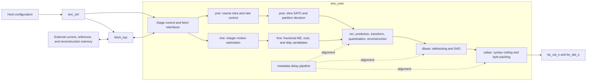

# Đặc tả RTL bộ mã hóa H.265

## 1. Trạng thái tài liệu

Tài liệu này mô tả hành vi đã được triển khai trong top tích hợp RTL `h265enc_top`.
Đây là **đặc tả theo hiện trạng triển khai**, không phải bản thay thế cho chuẩn ITU-T H.265
hoặc ISO/IEC 23008-2.

| Mục | Giá trị |
|---|---|
| RTL top | `top/enc_top.v`, module `h265enc_top` |
| Phiên bản nguồn đã rà soát | `15d7754124d847adc1b3de43f12aee9278437e08` |
| Môi trường mô phỏng chính | `../sim/top_testbench/` |
| Tổ chức pixel | YUV 4:2:0, 8-bit |
| Cấu trúc mã hóa | Ảnh I và P do host chọn |
| Ranh giới đầu ra | Các byte payload slice đã mã hóa CABAC |

Khi README và RTL khác nhau về mức chi tiết, RTL là nguồn có tính quyết định. Các
cam kết hiệu năng của dự án được tách riêng với hành vi đã xác minh bằng đọc nguồn
hoặc artefact mô phỏng.

### 1.1 Ngôn ngữ quy phạm

`shall`, `must`, và `required` mô tả các yêu cầu tích hợp cần thiết để dùng RTL
hiện tại một cách an toàn. `supports` mô tả logic có trong mã nguồn đã rà soát.
`claimed` mô tả tuyên bố của dự án nhưng chưa được chứng minh bằng bằng chứng timing
hoặc tương thích hiện có.

### 1.2 Phạm vi

Tài liệu này bao phủ:

- các khả năng codec đã triển khai và các phần cố ý loại trừ;
- tín hiệu top-level và trường cấu hình;
- giao thức frame, external-memory và output-byte;
- kiến trúc pipeline CTU và hành vi các khối xử lý;
- định dạng input, reference, reconstruction và payload;
- trình tự tích hợp, luồng xác minh và các khoảng trống giao diện còn mở.

VPS, SPS, PPS, dựng NAL-unit, Annex-B start code, mux container, chính sách DPB,
chính sách GOP và thiết kế bus register host nằm ngoài top RTL và là trách nhiệm
phía host.

## 2. Năng lực đã triển khai

### 2.1 Tóm tắt tính năng codec

| Khả năng | Trạng thái hiện trạng | Bằng chứng hoặc ghi chú |
|---|---|---|
| Mục tiêu HEVC Main Profile | Mục tiêu dự án | Được nêu trong `../README.md`; chưa có bằng chứng conformance đầy đủ trong repo này. |
| Định dạng mẫu | 8-bit YUV 4:2:0 | `PIXEL_WIDTH=8`; testbench lưu một mặt phẳng luma và chroma xen kẽ, nửa chiều cao. |
| Loại ảnh | I và P | `sys_type_i` là 1 bit: `0=INTRA`, `1=INTER`. Không có điều khiển B-picture. |
| Kích thước CTU | 64x64 mẫu luma | `LCU_SIZE=64`. |
| Cây quadtree CU | Inter: 64x64 đến 8x8; intra: 32x32 đến 8x8 | Quyết định POSI tích hợp luôn tách root intra 64x64. CTU inter có thể giữ 64x64. |
| Dự đoán intra | Planar, DC và angular mode 2 đến 33 | Datapath mode-34 tồn tại, nhưng PREI tích hợp không chọn được. Build này chọn 34 trong 35 mode luma HEVC. |
| Kích thước PU intra | 4x4, 8x8, 16x16, 32x32 | 4x4 có ở CU intra nhỏ nhất; không có PU intra 64x64 được chọn. |
| Dự đoán chroma intra | Suy ra từ mode luma đã chọn | Không có quyết định mode chroma độc lập; CABAC phát tín hiệu theo mode suy ra. |
| Phân hoạch inter | Symmetric 2Nx2N, 2NxN, Nx2N | Mã nội bộ thứ tư biểu diễn CU split. Asymmetric motion partition không được lộ ra. |
| Motion estimation | Tìm kiếm integer có lập trình + tinh chỉnh phân số | Tối đa 8 command IME đóng gói; FME tinh chỉnh tới độ chính xác quarter-luma-sample. |
| Ảnh reference | Một ảnh reference được cung cấp ngoài cho mỗi ảnh P | Không có chỉ số reference-list ở giao diện top-level. |
| Kích thước transform | 4x4, 8x8, 16x16, 32x32 | Có đủ 4 datapath, nhưng cấu trúc TU được suy ra từ độ sâu CU/intra NxN thay vì RDO độc lập. |
| Lượng tử hóa | QP theo CTU với feedback và ROI tùy chọn | Datapath QP 6-bit; tích hợp phải ràng buộc QP theo vùng HEVC mà thiết kế dùng. |
| Công cụ inter | MVD/prediction và SKIP dùng merge candidates | Cờ merge CABAC tích với skip; lựa chọn MERGE độc lập khi không-skip chưa được triển khai. |
| Intra-in-P | Tùy chọn | Điều khiển bởi `sys_IinP_ena_i`. |
| Mã entropy | CABAC | Có chuẩn bị syntax, binarization, cập nhật context, cập nhật arithmetic state và đóng gói byte. |
| Lọc trong vòng | Deblocking end-to-end; SAO chỉ có datapath sample trong build này | `sys_sao_ena_i` có thể sửa mẫu lưu trữ, nhưng `SAO_OPEN=0` loại bỏ syntax SAO khỏi CABAC. |
| CTU biên một phần | Đã triển khai | Thông tin phần frame còn lại được cung cấp cho mode decision, reconstruction, fetch và CABAC. |
| Rate control phần cứng | Có, nhưng kèm hạn chế | Có feedback và điều chỉnh QP ROI hình chữ nhật; xem Mục 7. |
| Rate control phần mềm | Ngoài RTL | Host cung cấp frame QP và các hệ số rate-control. |
| 4K ở 30 fps, 400 MHz | Tuyên bố dự án | Nêu trong `../README.md`; không có ràng buộc timing hay báo cáo synthesis kèm theo. |

### 2.2 Các phần cố ý loại trừ và tính năng chưa xác minh

Thiết kế top hiện tại không cung cấp giao diện cho:

- B picture, bi-prediction hoặc nhiều active reference index;
- tiles, wavefront parallel processing hoặc nhiều slice điều khiển độc lập;
- VPS/SPS/PPS, tạo slice-header, NAL header, start code, SEI hoặc VUI;
- mẫu 10/12-bit hoặc chroma 4:2:2/4:4:4;
- backpressure cho output hoặc tín hiệu final payload drained lộ ra ngoài;
- wrapper bus chuẩn APB, AHB, AXI hoặc streaming.
- chọn mode intra chroma độc lập hoặc cấu trúc transform-tree được RDO chọn.

Việc một tính năng không nằm trong danh sách này không chứng minh tuân thủ chuẩn.
Muốn khẳng định encoder Main Profile tuân thủ chuẩn, cần một chiến dịch xác minh decoder.

## 3. Quy ước ảnh và dữ liệu

### 3.1 Kích thước ảnh

`sys_all_x_i` và `sys_all_y_i` là chiều rộng và chiều cao luma hoạt động, tính theo pixel.
Top chuyển chúng thành tọa độ CTU cuối cùng, bao gồm cả biên:

```text
last_ctu_x = ceil(width  / 64) - 1
last_ctu_y = ceil(height / 64) - 1
```

Tọa độ CTU nội bộ dùng 6 bit, vì vậy không ảnh nào được vượt quá 64 CTU theo
mỗi chiều. Dù cổng width là 13 bit, độ rộng cổng đó không mở rộng năng lực tọa
độ CTU nội bộ. Với ràng buộc căn chỉnh 4 pixel, giới hạn biểu diễn được là 4096
pixel theo chiều rộng và 4092 pixel theo chiều cao; cổng height 12 bit không
biểu diễn được 4096.

Với triển khai này:

- chiều rộng và chiều cao phải dương;
- chiều rộng và chiều cao phải là bội số của 4 mẫu luma;
- không bắt buộc là bội số của 64;
- layout 4:2:0 yêu cầu chroma có kích thước chẵn;
- responder ngoài phải phục vụ trọn descriptor mà RTL yêu cầu, kể cả beat nằm ngoài
  ảnh hoạt động ở mép phải hoặc mép dưới.

RTL có masking biên ảnh đang hoạt động và extend biên reference, nhưng giao
diện ngoài vẫn yêu cầu các tile/window kích thước cố định. Responder ngoài phải
trả về giá trị xác định cho mọi beat load được yêu cầu. Giao diện này không quy
định giá trị padding cho mẫu không hoạt động.

### 3.2 Thứ tự CTU

CTU được khởi chạy theo raster scan. X tăng trước; tới X cuối cùng thì quay về 0
và Y tăng. Pipeline được nạp, xử lý nhiều CTU đồng thời, rồi xả sau CTU đầu vào
cuối cùng.

### 3.3 Bố cục frame ngoài

Testbench tham chiếu mô hình lưu trữ đánh địa chỉ theo byte như sau:

```text
luma_base   = 0
luma_addr   = y * picture_width + x
chroma_base = picture_width * picture_height
chroma_addr = chroma_base + chroma_y * picture_width + x
```

Vùng chroma dùng byte xen kẽ `U,V,U,V,...` với stride byte giống chiều rộng luma
và số hàng bằng một nửa. Input YUV planar được testbench chuyển sang layout này.
Nguồn kiểu NV12 xen kẽ có thể nạp trực tiếp.

Các công thức trên chỉ áp dụng cho tọa độ hoạt động. Một descriptor biên 64-byte
có thể chứa tọa độ ngoài chiều rộng hoặc chiều cao hoạt động. Responder phải kiểm
tra biên từng mẫu: sinh padding xác định cho load ngoài vùng và bỏ qua store ngoài
vùng. Không được cho phép X ngoài vùng bị wrap sang hàng hoạt động kế tiếp. Một
surface/stride đã padding vật lý cũng hợp lệ nếu phép ánh xạ địa chỉ vẫn giữ đúng
hành vi này.

### 3.4 Thứ tự byte trong beat ngoài

Mỗi beat ngoài chứa 16 pixel:

```text
extif_data[127:120] = pixel[x + 0]
extif_data[119:112] = pixel[x + 1]
...
extif_data[7:0]     = pixel[x + 15]
```

Beat và hàng được truyền theo thứ tự raster tăng dần. Giao diện không có địa chỉ
riêng cho mỗi beat; responder bộ nhớ suy ra địa chỉ từ descriptor và bộ đếm beat.

## 4. Kiến trúc

### 4.1 Cấu trúc top-level



`h265enc_top` instantiate `enc_ctrl`, `fetch_top` và `enc_core`. `enc_core`
instantiate các block PREI, POSI, IME, FME có buffer, sau đó là reconstruction,
DB/SAO, CABAC và metadata pipeline.

### 4.2 Lịch pipeline

`enc_ctrl` dùng bộ điều khiển 11 trạng thái cho fill/steady-state/drain. Mỗi stage
xử lý nhận một xung `start` kéo dài một chu kỳ và trả về một xung `done`.
Các sự kiện done được giữ lại cho tới khi toàn bộ công việc đang hoạt động của
bước pipeline hiện tại hoàn tất.

Với ảnh I:

```text
fetch -> PREI -> POSI -> REC(intra + T/Q) -> DB/SAO -> CABAC
```

Với ảnh P:

```text
fetch -> [PREI || IME] -> [POSI || FME] -> REC(MC + T/Q, optional I-in-P)
      -> DB/SAO -> CABAC
```

PREI và IME chạy song song ở stage quyết định đầu tiên. POSI và FME chạy song
song ở stage quyết định thứ hai. Stage của ảnh P không chuyển tiếp cho tới khi cả
hai thành phần của cặp tương ứng cùng hoàn tất.

Metadata pipeline chỉ tiến theo xung aggregate CTU pipeline-advance. Nó canh
QP, quyết định intra/inter, chọn I-in-P, cờ coded block, cờ skip/chỉ số merge và
đếm byte output với các stage sau.

### 4.3 Hành vi các block xử lý

| Block | Hành vi bắt buộc |
|---|---|
| `fetch` | Thực thi load/store ngoài theo thứ tự, đệm mẫu current/reference, mở rộng biên reference và cung cấp truy cập mẫu đã lập chỉ mục cho các stage xử lý. |
| `prei` | Ước lượng/chọn mode intra cho hierarchy CU 64/32/16/8, tạo metric độ phức tạp và tính QP của CTU. |
| `posi` | Đánh giá mode intra do PREI cung cấp bằng SATD cộng chi phí mode-rate ước lượng, quyết định cây split intra với root 64x64 bị ép tách, và lưu mode đã chọn. |
| `ime` | Thực thi các lệnh integer-search đã lập trình, tính chi phí SAD/MV, chọn phân hoạch đối xứng và ghi integer MV. |
| `fme` | Tạo MV candidate, thực hiện nội suy half/quarter-pel và đánh giá chi phí SATD, tinh chỉnh MV, sinh prediction sample và xác định SKIP dùng merge candidates. |
| `rec` | Chọn dự đoán intra hoặc inter, thực hiện dự đoán luma/chroma, transform, lượng tử hóa, inverse quantization/transform, reconstruction, sinh CBF và MVD. |
| `dbsao` | Suy ra biên và strength, áp dụng deblocking luma/chroma nếu bật, và triển khai datapath thống kê/offset/sample của SAO. Syntax SAO không được CABAC tiêu thụ trong build đã rà soát. |
| `cabac` | Chuẩn bị syntax CU/TU/MV đã bật, binarize, cập nhật context và trạng thái arithmetic, kết thúc payload slice và phát byte đã đóng gói. `SAO_OPEN=0` bỏ qua syntax SAO. |

## 5. Giao diện top-level

Tất cả tín hiệu đều đồng bộ với `clk` trừ khi được ghi chú rõ là reset. Các độ
rộng bên dưới được suy ra từ `enc_defines.v` đã rà soát.

### 5.1 Clock, reset và điều khiển frame

| Tín hiệu | Hướng | Độ rộng | Ý nghĩa và yêu cầu |
|---|---:|---:|---|
| `clk` | In | 1 | Clock xử lý theo cạnh lên. |
| `rstn` | In | 1 | Reset bất đồng bộ mức thấp. Giữ trong lúc clock chưa ổn định; khuyến nghị nhả reset đồng bộ. |
| `sys_start_i` | In | 1 | Xung bắt đầu frame một chu kỳ, chấp nhận khi idle. Start khi đang bận không được xếp hàng. |
| `sys_done_o` | Out | 1 | Xung hoàn tất scheduler frame một chu kỳ. Không phải dấu mốc bảo đảm byte cuối đã thoát hết. |
| `sys_type_i` | In | 1 | `0`: ảnh I; `1`: ảnh P. |
| `sys_all_x_i` | In | 13 | Chiều rộng luma hoạt động, tính theo pixel. |
| `sys_all_y_i` | In | 12 | Chiều cao luma hoạt động, tính theo pixel. |
| `sys_init_qp_i` | In | 6 | QP cơ sở của slice/frame dùng cho CABAC initialization, rate control và tính chi phí MV của IME. Ràng buộc `0..51`. |
| `sys_IinP_ena_i` | In | 1 | Bật chọn intra-CU trong ảnh P. |
| `sys_db_ena_i` | In | 1 | Bật sửa mẫu deblocking. |
| `sys_sao_ena_i` | In | 1 | Bật quyết định SAO và sửa mẫu; syntax CABAC hiện tại vẫn bị vô hiệu bởi `SAO_OPEN=0`. |
| `sys_posi4x4bit_i` | In | 5 | Số bit ước lượng của POSI dùng cho mỗi candidate intra 4x4 trước khi scale lambda. |

Tất cả input cấu hình phải hợp lệ trước `sys_start_i` và giữ ổn định cho tới
`sys_done_o`, vì top không chốt toàn bộ record cấu hình của frame.

### 5.2 Ngưỡng skip

| Tín hiệu | Hướng | Độ rộng | Ý nghĩa |
|---|---:|---:|---|
| `skip_cost_thresh_08` | In | 32 | Ngưỡng cost quyết định skip cho CU 8x8. |
| `skip_cost_thresh_16` | In | 32 | Ngưỡng cost quyết định skip cho CU 16x16. |
| `skip_cost_thresh_32` | In | 32 | Ngưỡng cost quyết định skip cho CU 32x32. |
| `skip_cost_thresh_64` | In | 32 | Ngưỡng cost quyết định skip cho CU 64x64. |

Các ngưỡng này đi thẳng vào logic skip của FME. Thang giá trị hữu dụng phụ thuộc
QP, lambda và mô hình cost được chọn. Testbench mặc định nạp cả bốn bằng 0.

### 5.3 Giao diện rate control

| Tín hiệu | Hướng | Độ rộng | Ý nghĩa |
|---|---:|---:|---|
| `sys_rc_mod64_sum_o` | Out | 32 | 32 bit thấp của tổng metric độ phức tạp PREI 64x64 tích lũy kể từ reset. |
| `sys_rc_bitnum_i` | In | 32 | Input mục tiêu đếm bit dự trữ; được route vào `rate_control` nhưng không dùng trong phép tính đã rà soát. |
| `sys_rc_k` | In | 16 | Hệ số fixed-point dùng để dự đoán số output tích lũy từ complexity bị trễ. |
| `sys_rc_roi_height` | In | 6 | Chiều cao ROI theo CTU. |
| `sys_rc_roi_width` | In | 7 | Chiều rộng ROI theo CTU. |
| `sys_rc_roi_x` | In | 7 | Tọa độ trái ROI theo CTU. |
| `sys_rc_roi_y` | In | 7 | Tọa độ trên ROI theo CTU. |
| `sys_rc_roi_enable` | In | 1 | Bật giảm QP trong ROI. |
| `sys_rc_L1_frame_byte` | In | 10 | Ngưỡng sai số dự đoán tuyệt đối thứ nhất. |
| `sys_rc_L2_frame_byte` | In | 10 | Ngưỡng sai số dự đoán tuyệt đối thứ hai. Phải lớn hơn hoặc bằng L1. |
| `sys_rc_lcu_en` | In | 1 | Bật điều chỉnh QP theo feedback sau hàng CTU đầu tiên. |
| `sys_rc_max_qp` | In | 6 | QP CTU lớn nhất cho output. |
| `sys_rc_min_qp` | In | 6 | QP CTU nhỏ nhất cho output. |
| `sys_rc_delta_qp` | In | 6 | Mức giảm QP không dấu trong ROI. |

Mục 7 mô tả phép tính đã triển khai và các ràng buộc.

### 5.4 Giao diện lệnh IME

| Tín hiệu | Hướng | Độ rộng | Ý nghĩa |
|---|---:|---:|---|
| `sys_ime_cmd_num_i` | In | 3 | Chỉ số lệnh cuối cùng, bao gồm cả lệnh đó. `0` chạy một lệnh và `7` chạy tám lệnh. |
| `sys_ime_cmd_dat_i` | In | 232 | Tám slot lệnh, mỗi slot 29 bit. Slot 0 nằm ở 29 bit thấp nhất. |

### 5.5 Giao diện external-memory

| Tín hiệu | Hướng | Độ rộng | Ý nghĩa |
|---|---:|---:|---|
| `extif_start_o` | Out | 1 | Xung bắt đầu descriptor giao dịch trong một chu kỳ. |
| `extif_done_i` | In | 1 | Xung hoàn tất giao dịch từ responder bộ nhớ. |
| `extif_mode_o` | Out | 5 | Mã mode giao dịch theo Mục 6. |
| `extif_x_o` | Out | 12 | Tọa độ X của descriptor theo byte luma. |
| `extif_y_o` | Out | 12 | Tọa độ Y của descriptor; responder chroma diễn giải theo Mục 6. |
| `extif_width_o` | Out | 8 | Chiều rộng descriptor theo byte/pixel. |
| `extif_height_o` | Out | 8 | Chiều cao descriptor trong miền luma. Giao dịch chroma dùng số hàng lưu trữ bằng một nửa. |
| `extif_wren_i` | In | 1 | Strobe ghi theo beat vào bộ nhớ fetch của encoder trong một load ngoài-đến-encoder. |
| `extif_rden_i` | In | 1 | Strobe đọc/sample theo beat cho một store encoder-đến-ngoài. |
| `extif_data_i` | In | 128 | Mười sáu mẫu 8-bit được drive trong một beat load. |
| `extif_data_o` | Out | 128 | Mười sáu mẫu 8-bit được xuất trong một beat store. |

Tên `wren` và `rden` được nhìn từ phía bộ đệm nội bộ của encoder. Giao diện này
không phải AXI và không có address, ready, response, burst hoặc ID channel.

### 5.6 Giao diện byte output

| Tín hiệu | Hướng | Độ rộng | Ý nghĩa |
|---|---:|---:|---|
| `bs_val_o` | Out | 1 | Xác nhận một byte payload output trong cùng chu kỳ. |
| `bs_dat_o` | Out | 8 | Byte payload đã mã hóa bằng CABAC. |

Không có input `ready`. Sink phải nhận mọi byte khi `bs_val_o=1`.

## 6. Giao thức external-memory

### 6.1 Mã mode và hình học descriptor

| Mã | Tên | Hướng | Hình học descriptor |
|---:|---|---|---|
| 3 | `LOAD_CUR_LUMA` | Ngoài đến encoder | `x=ctu_x*64`, `y=ctu_y*64`, `width=64`, `height=64` |
| 4 | `LOAD_REF_LUMA` | Ngoài đến encoder | Gốc cửa sổ search do RTL chọn, `width=64` hoặc `128`, `height=128` |
| 5 | `LOAD_CUR_CHROMA` | Ngoài đến encoder | `x=ctu_x*64`, `y=ctu_y*64`, `width=64`, `height=64`; truyền 32 hàng chroma |
| 6 | `LOAD_REF_CHROMA` | Ngoài đến encoder | Gốc cửa sổ search luma bị trễ, `width=64` hoặc `128`, `height=128`; truyền 64 hàng chroma |
| 7 | `LOAD_DB_LUMA` | Ngoài đến encoder | `x=ctu_x*64`, `y=ctu_y*64-4`, `width=64`, `height=4`; tắt cho hàng CTU đầu |
| 8 | `LOAD_DB_CHROMA` | Ngoài đến encoder | `x=ctu_x*64`, `y=ctu_y*64-8`, `width=64`, `height=8`; truyền 4 hàng chroma; tắt cho hàng đầu |
| 9 | `STORE_DB_LUMA` | Encoder đến ngoài | `width=64`; nhóm hàng đầu dùng `y=0,height=64`, các nhóm sau dùng `y=ctu_y*64-4,height=68` |
| 10 | `STORE_DB_CHROMA` | Encoder đến ngoài | `width=64`; nhóm hàng đầu dùng `y=0,height=64`, các nhóm sau dùng `y=ctu_y*64-8,height=72`; truyền hàng chroma nửa chiều cao |

Store X có thể trỏ tới cột CTU trước đó đã bị trễ theo pipeline. Cột ngoài cùng bên phải được flush riêng. Responder phải dùng các output descriptor làm giá trị chuẩn, không tự dựng lại tọa độ từ CTU đầu vào hiện tại.

Giao diện không có base address hay surface ID. Host/wrapper phải ánh xạ mode
3/5 sang surface current, mode 4/6 sang một surface reference L0 đã chọn, và
mode 7/8/9/10 sang surface reconstruction/in-loop. Những ánh xạ và base address
này phải ổn định trong suốt frame. Current input, selected reference và
reconstruction surface không được alias trừ khi host đã chứng minh được thứ tự
truy cập pipeline là an toàn.

### 6.2 Giao dịch load

1. Lấy mẫu `mode/x/y/width/height` khi `extif_start_o` lên mức 1.
2. Tạo `width/16` beat cho mọi hàng áp dụng theo thứ tự raster.
3. Ở mỗi beat, drive `extif_data_i` và pulse `extif_wren_i` trong một chu kỳ.
4. Sau khi tất cả beat được nhận, hạ `extif_wren_i` và pulse `extif_done_i`
   trong một chu kỳ ở một chu kỳ riêng.
5. Không drive thêm beat nào sau `extif_done_i`.

Với luma, số hàng bằng `height`. Với chroma, số hàng bằng `height/2` vì
descriptor được biểu diễn theo tọa độ Y miền luma.

### 6.3 Giao dịch store

1. Lấy mẫu descriptor khi `extif_start_o` lên 1.
2. Với mỗi beat theo thứ tự raster, assert `extif_rden_i` và sample `extif_data_o`
   ở chu kỳ đó.
3. Truyền `width/16` beat cho mỗi hàng áp dụng.
4. Hạ `extif_rden_i`, rồi pulse `extif_done_i` trong một chu kỳ ở chu kỳ riêng
   sau beat cuối.

RTL không cung cấp valid dữ liệu store độc lập với `extif_rden_i`; lịch beat của
responder là cơ chế qualification.

Testbench tham chiếu drive strobe beat và sample store data ở cạnh xuống, tách
khỏi cập nhật state tại cạnh lên của RTL. Wrapper production phải giữ được timing
setup/hold tương đương: dữ liệu load và strobe phải ổn định tại cạnh lên chủ động,
trong khi dữ liệu store chỉ được chốt sau khi đường địa chỉ/RAM được chọn bởi
`extif_rden_i` đã ổn định. Nếu wrapper retime quy ước nửa chu kỳ này, nó phải
xác minh lại ánh xạ beat-đến-địa chỉ bằng mô phỏng và STA. Không có hợp đồng
timing ready/valid tổng quát nào ngoài hiện trạng đã rà soát này.

### 6.4 Thứ tự

Trong một bước tiến pipeline CTU, fetch xét các operation theo thứ tự:

```text
current luma -> reference luma -> current chroma -> reference chroma
             -> DB luma load -> DB chroma load
             -> reconstructed luma store -> reconstructed chroma store
```

Các operation bị tắt sẽ bị bỏ qua. Ảnh I không load reference luma/chroma. Ảnh P
load reference do host cung cấp. Load DB-top bị bỏ qua ở hàng CTU đầu tiên; store
bị trễ để xử lý chồng lấn lọc trái/trên.

## 7. Hành vi cấu hình

### 7.1 Loại frame và quyền sở hữu GOP

Phần cứng không có bộ đếm GOP. Host chọn từng frame độc lập bằng cách drive
`sys_type_i` trước `sys_start_i`. Chuỗi low-delay điển hình là một ảnh I rồi tới
các ảnh P. Host cũng chọn frame reconstruction nào được trả về bởi giao dịch
load reference; testbench cung cấp frame đã encode trước đó.

### 7.2 QP và rate control phần cứng

Khối rate-control đã triển khai hoạt động sau quyết định intra coarse. Hành vi
được tóm tắt như sau:

```text
complexity_sum += current_ctu_complexity
output_count   += previous_cabac_valid_byte_count
predicted_count = (delayed_complexity_sum * sys_rc_k) >> 28
error = abs(output_count - predicted_count)
step  = 2 if error > L2 else 1 if error > L1 else 0

if hardware_feedback_disabled or ctu_y == 0:
    candidate_qp = sys_init_qp_i
else if output_count > predicted_count:
    candidate_qp = sys_init_qp_i + step
else:
    candidate_qp = sys_init_qp_i - step

if ROI enabled and CTU lies inside ROI:
    candidate_qp = candidate_qp - sys_rc_delta_qp

ctu_qp = clamp(candidate_qp, sys_rc_min_qp, sys_rc_max_qp)
```

Chi tiết quan trọng theo hiện trạng:

- đường `actual_bitnum` nội bộ đếm byte `bs_val_o`, dù tên tín hiệu mang nghĩa bit;
- bộ tích lũy complexity và output-count chỉ clear theo `rstn`, không theo mọi
  `sys_start_i`;
- `sys_rc_mod64_sum_o` cắt tổng 39-bit đang chạy xuống 32 bit;
- accumulated output count là 28 bit và bị wrap, trong khi byte count CABAC
  chốt cho một interval scheduler là 16 bit và cũng bị wrap;
- `sys_rc_bitnum_i` hiện chưa dùng;
- tọa độ và kích thước ROI là CTU và dùng hình chữ nhật half-open;
- phép trừ QP không dấu có thể underflow trước khi clamp.

Host phải cấu hình `0 <= min_qp <= max_qp <= 51` và `L1 <= L2`. Khi feedback bật,
`sys_init_qp_i` phải ít nhất bằng 2 vì phép trừ feedback xảy ra trước clamp. Nếu
ROI cũng bật, hãy cấu hình `sys_rc_delta_qp <= sys_init_qp_i - 2`; nếu không có
feedback, cấu hình `sys_rc_delta_qp <= sys_init_qp_i`. Các ràng buộc này ngăn
tràn dưới không dấu 6 bit trước clamp cuối cùng.

ROI bật phải có width/height khác 0 và nằm hoàn toàn trong lưới CTU hoạt động:

```text
roi_x + roi_width   <= ceil(picture_width  / 64)
roi_y + roi_height <= ceil(picture_height / 64)
```

Điều này cũng ngăn các biểu thức origin+cận 7 bit của RTL bị wrap. Nếu cần vận
hành fixed-QP xác định, hãy đặt `sys_rc_lcu_en=0`, tắt ROI và set min/max bao
phủ `sys_init_qp_i`.

### 7.3 Đóng gói lệnh IME

Mỗi command slot có 29 bit:

| Bit slot | Trường | Độ rộng | Diễn giải |
|---:|---|---:|---|
| `28:22` | `center_x` | 7 | Tọa độ tâm search ngang, signed two's-complement. |
| `21:16` | `center_y` | 6 | Tọa độ tâm search dọc, signed two's-complement. |
| `15:10` | `length_x` | 6 | Nửa chiều ngang không dấu. |
| `9:5` | `length_y` | 5 | Nửa chiều dọc không dấu. |
| `4:3` | `slope` | 2 | Biên search: `0=1/2`, `1=1`, `2=2`, `3=infinite/rectangular`. |
| `2` | `downsample` | 1 | Dùng bước search 2 pixel và dữ liệu current đã downsample. |
| `1` | `partition` | 1 | Chạy quyết định phân hoạch cho command này. Lệnh cuối bị ép phải quyết định. |
| `0` | `use_feedback` | 1 | Recenter bằng feedback trước đó; chỉ hiệu lực khi `downsample=0`. |

Command `i` nằm ở:

```text
sys_ime_cmd_dat_i[(29*i) +: 29]
```

Bộ điều khiển thực thi các slot từ 0 tới `sys_ime_cmd_num_i`, bao gồm cả chỉ số cuối.
Tất cả 8 slot phải được drive giá trị xác định ngay cả khi ít hơn 8 lệnh được thực thi.

### 7.4 Điều khiển filter

Deblocking được điều khiển end-to-end bởi `sys_db_ena_i`. Nếu tắt, stage DB
forward mẫu không sửa nhưng vẫn giữ timing pipeline.

SAO **không được bật end-to-end trong build đã rà soát**. `sys_sao_ena_i`
điều khiển quyết định SAO và datapath mẫu reconstructed, nhưng `enc_defines.v`
đặt `SAO_OPEN=0`, làm phần chuẩn bị syntax CABAC bỏ qua syntax SAO. Vì vậy,
bật datapath sample có thể làm stored reference khác với ảnh mà decoder sẽ tái
tạo từ payload phát ra.

Để output nhất quán, tích hợp viên phải giữ `sys_sao_ena_i=0` và báo SAO tắt
trong slice header tạo bởi host. Muốn bật SAO phải sửa cấu hình build CABAC và
hoàn tất xác minh bit-exact encoder/decoder. Testbench tham chiếu gộp DB và SAO
vào một cờ `ENABLE_DBSAO`, nên chế độ bật của nó hữu ích để đo activity datapath
nhưng chưa đủ để gọi là kiểm thử conformance.

## 8. Hợp đồng payload đầu ra

### 8.1 Luồng byte

`bs_dat_o` chỉ hợp lệ khi `bs_val_o` được assert. Byte được phát trực tiếp từ
CABAC bit packer và không thể bị stall. Golden hex stream trong repo khớp với các
phần payload đã mã hóa của vector phần mềm, trong khi artefact `.hevc` đầy đủ lớn
hơn vì còn chứa framing/header.

Không có logic NAL-header, Annex-B start code, length-prefix hoặc emulation-prevention
giữa CABAC bit packer và `bs_dat_o`. Hãy xem output như byte slice-data CABAC
trước EBSP, không phải RBSP, EBSP, NAL unit, access unit hay file `.hevc` hoàn chỉnh.
Đường CABAC có tạo termination và final byte packing, nhưng nguồn không công bố hợp
đồng hình thức cho điểm splice slice-header hoặc chính sách trailing/alignment byte.

Host phải tự dựng tất cả parameter set, slice/NAL header, start code hoặc length
field, emulation-prevention byte và metadata container. Trước khi dùng stream trong
sản phẩm, phải kiểm tra điểm splice giữa header và byte CABAC cùng byte cuối bằng
golden payload checked-in và một decoder độc lập. Giao diện công khai hiện tại chưa
đủ để chứng minh việc lắp NAL là tuân thủ.

Syntax do host tạo phải nhất quán với ít nhất các cấu hình RTL sau:

| Thuộc tính syntax | Cấu hình bắt buộc |
|---|---|
| Chroma và bit depth | 4:2:0, luma/chroma 8-bit |
| Kích thước ảnh hoạt động | Khớp `sys_all_x_i` và `sys_all_y_i` |
| Giới hạn coding block | CU nhỏ nhất 8x8, CTU lớn nhất 64x64 |
| Giới hạn transform block | Nhỏ nhất 4x4, lớn nhất 32x32 |
| Loại ảnh/slice | I khi `sys_type_i=0`; P khi `sys_type_i=1` |
| Số reference P | Một reference L0; không có reference L1 |
| Override CABAC init | Tắt (`cabac_init_flag=0`) |
| Số merge-candidate tối đa | Năm (`five_minus_max_num_merge_cand=0`) |
| QP delta của CU | PPS `cu_qp_delta_enabled_flag=1` và `diff_cu_qp_delta_depth=0` cho một nhóm lượng tử cấp CTU |
| Tiles và entropy sync | Tắt/không signaled là active |
| SAO | Tắt trong SPS/slice và `sys_sao_ena_i=0` cho build này |
| Deblocking | Hành vi header/PPS phải khớp `sys_db_ena_i` |
| QP slice ban đầu | Giá trị PPS/slice QP phải suy ra `sys_init_qp_i` |

Bảng này là checklist nhất quán, không phải công thức đầy đủ cho VPS/SPS/PPS/slice-header.

### 8.2 Khoảng trống hoàn tất

Hệ thống CABAC có một tín hiệu `slice_done_o` cuối cùng sau khi bit-pack drain,
nhưng `enc_core` để tín hiệu này không nối. `sys_done_o` được tạo từ scheduler CTU
và hoàn tất stage syntax CABAC. Vì vậy:

- consumer phải bắt `bs_dat_o` bất cứ khi nào `bs_val_o` lên 1, độc lập với `sys_done_o`;
- không được diễn giải `sys_done_o` như marker byte cuối đã được định nghĩa;
- giao diện công khai hiện tại không thể báo dứt khoát việc drain payload cuối.

Tích hợp production phải đưa tín hiệu slice-drained sẵn có của CABAC ra wrapper-level
`payload_done`, hoặc thêm một tín hiệu end-of-output tương đương đã được xác minh.
Không có bổ sung này, `h265enc_top` chỉ phù hợp trong trường hợp một cơ chế hoàn tất
theo test riêng là chấp nhận được. Guard time cố định không thuộc đặc tả này và
không được giả định nếu chưa kiểm chứng cycle-level.

## 9. Trình tự vận hành frame

```mermaid
sequenceDiagram
  participant H as Host
  participant E as h265enc_top
  participant M as External memory
  participant S as Payload sink

  H->>E: Assert rstn=0
  H->>E: Deassert rstn after clock is stable
  H->>E: Drive stable frame, RC, skip, and IME configuration
  H->>E: Pulse sys_start_i for one clock
  par Service external transactions
    loop Each external transaction
      E->>M: extif_start_o plus descriptor
      alt Load
        M->>E: extif_wren_i plus extif_data_i beats
      else Store
        M->>E: extif_rden_i; sample extif_data_o beats
      end
      M->>E: Pulse extif_done_i
    end
  and Capture payload continuously
    loop Whenever bs_val_o is high
      E->>S: bs_val_o plus bs_dat_o
    end
  end
  E->>H: Pulse sys_done_o
  opt Bit packer still draining
    E->>S: Additional bs_val_o plus bs_dat_o
  end
  Note over H,S: Internal slice_done_o is not exposed by h265enc_top
```

Yêu cầu tích hợp:

1. Reset toàn bộ state frame và service bộ nhớ trước frame đầu tiên.
2. Cung cấp current-picture memory trước khi bắt đầu frame.
3. Với ảnh P, cung cấp một reference picture hợp lệ cho mọi load mode 4/6.
4. Giữ toàn bộ cấu hình ổn định từ trước start cho tới khi scheduler hoàn tất.
5. Phục vụ mọi descriptor và không chờ một tín hiệu beat-ready không tồn tại.
6. Chấp nhận mọi byte payload hợp lệ mà không có backpressure.
7. Giữ mode 9/10 store làm reference reconstructed cho ảnh P sau nếu chính sách GOP yêu cầu.
8. Wrapper production phải cung cấp `payload_done`; không bắt đầu frame tiếp theo cho tới khi cả `sys_done_o` và tín hiệu drain đã xác minh cùng xảy ra.

## 10. Timing và hiệu năng

RTL không có bộ chia clock lập trình và không có phụ thuộc tần số tường minh.
Các handshake chức năng tính theo chu kỳ clock. Độ trễ external-memory biến động:
mỗi state fetch sẽ chờ `extif_done_i`.

Thông lượng pipeline bị giới hạn bởi block CTU hoạt động song song chậm nhất cộng
với dịch vụ external-memory. Bộ điều khiển chồng lấp tối đa các pha fetch, hai nhóm
quyết định, reconstruction, DB/SAO, CABAC và store trong trạng thái steady-state,
sau đó xả pipeline.

Không có latency frame cố định, latency phản hồi bộ nhớ tối đa hay chu kỳ khởi tạo
CTU được bảo đảm bởi top. Những giá trị này phải được đo cho cấu hình và hệ thống
bộ nhớ mục tiêu. Testbench đi kèm chạy clock mô phỏng 100 MHz; điều đó không xác
nhận mục tiêu 400 MHz trong README.

## 11. Đặc tả xác minh

### 11.1 Build và mô phỏng

Chạy từ `../sim/top_testbench/`:

```sh
make vlog   # ModelSim compile
make vsim   # ModelSim compile and run
make nclog  # ncverilog compile
make ncsim  # ncverilog run
make vcs    # VCS run with FSDB/debug
```

Makefile yêu cầu cài đặt local ModelSim/Questa, ncverilog, VCS và Novas/Verdi.
Nó có chứa path đặc thù môi trường có thể cần chỉnh lại cục bộ.

### 11.2 Cấu hình test tham chiếu

Mặc định testbench checked-in là:

| Tham số | Mặc định |
|---|---:|
| Rộng x cao | 416x240 |
| QP ban đầu | 20 |
| Tổng frame | 2 |
| Độ dài GOP | 50 |
| I test | Bật |
| P test | Tắt |
| I-in-P | Tắt |
| Deblocking và SAO | Tắt |
| Copy DPB phần cứng | Bật |
| Clock testbench | 100 MHz |

Tên file mặc định không phải smoke `tv/BlowingBubbles.yuv` không được check in.
Hãy dùng một override `FILE_CUR_YUV` hợp lệ, ví dụ chuỗi Foreman 416x240 mười frame
đi kèm, và đặt `FRAME_TOTAL`, `GOP_LENGTH`, `TEST_I`, `TEST_P` nhất quán.

Danh tính artefact checked-in:

| Artefact | Kích thước/số lượng | SHA-256 |
|---|---:|---|
| `tv/foreman_10frames_416x240.yuv` | 1,497,600 byte, 10 frame | `70f10f28ec80c76bec3ef7f214d8fe3a19b8908aaa8ff6a91c0a4b79b080a564` |
| `tv/rec.yuv` | 299,520 byte, 2 frame | `b008a9c6159aa249105619dea42785147a29bc09cc268267509365af830bb206` |
| `tv/s_bit_stream.dat` | 45,173 token hex-byte | `9c6058d072ce2b6b1088b1713d86ecc42ba4b8de80b7d8ea72dc908b9ba22459` |

Chuỗi Foreman phù hợp cho kiểm tra hoàn tất/activity khi golden check bị tắt,
nhưng không khớp với payload và REC golden checked-in. Vì nguồn BlowingBubbles
mặc định không có, revision này không chứa một regression top-level bit-exact tự
chứa.

Một smoke có thể lặp lại và dựa trên artefact checked-in dùng các compile define
sau ngoài `file_list.f`:

```text
+define+FRAME_WIDTH=416
+define+FRAME_HEIGHT=240
+define+FRAME_TOTAL=10
+define+GOP_LENGTH=10
+define+TEST_I=1
+define+TEST_P=1
+define+INITIAL_QP=20
+define+ENABLE_DBSAO=0
+define+USE_HW_DPB=1
+define+FILE_CUR_YUV="./tv/foreman_10frames_416x240.yuv"
+define+SMOKE_NO_GOLDEN
+define+NO_DUMP
```

Smoke chỉ pass nếu cả 10 frame đều phát `sys_done_o`, simulator không báo lỗi/fatal,
và run kết thúc bình thường. Nó không chứng minh tính đúng của payload hay reconstruction.

### 11.3 Kiểm tra golden

Không có `SMOKE_NO_GOLDEN`, testbench bật:

- so sánh byte với `tv/s_bit_stream.dat` mỗi khi `bs_val_o` được assert;
- so sánh reconstructed-store với `tv/rec.yuv` cho các word active đủ 16 pixel.

Testbench cũng hỗ trợ các monitor tùy chọn cho rate/distortion, in-loop,
throughput, DB/SAO-cycle và per-block-cycle.

Hạn chế xác minh đã biết:

- không có timeout khi chờ `sys_done_o`;
- mismatch bitstream dùng `$finish`, không phải `$fatal`;
- golden scanner không kiểm tra EOF hoặc số byte cuối chính xác;
- word store ở mép không được so sánh đầy đủ;
- `SMOKE_NO_GOLDEN` chỉ chứng minh hoàn tất/activity, không chứng minh bit-exact;
- môi trường này tự nó không tạo ra một stream Annex-B decodable hoàn chỉnh từ `bs_dat_o`.

Hạ tầng regression tự động phải parse thông báo mismatch và số byte thay vì chỉ
dựa vào exit status của simulator.

Một regression bit-exact chỉ hoàn tất khi nó cũng:

- check in hoặc sinh một cách xác định chuỗi nguồn tương ứng với cả hai golden;
- ghi lại toàn bộ compile define và cấu hình IME/RC;
- áp timeout tối đa được cấu hình;
- coi mọi mismatch, mẫu unknown, timeout, EOF golden sớm, hoặc byte output dư là lỗi process;
- quan sát đúng 45,173 chu kỳ payload-valid cho payload golden hai frame hiện có và tiêu thụ hết mọi token golden;
- so sánh mọi mẫu reconstructed active, kể cả word biên một phần.

### 11.4 Kịch bản chấp nhận tối thiểu

Một regression tích hợp phải gồm:

1. Một ảnh I canh CTU với DB và SAO tắt.
2. Một ảnh I không canh CTU để kiểm tra xử lý biên phải/dưới.
3. Một chuỗi I-P dùng mode 9/10 store reconstructed làm reference P.
4. Deblocking bật và tắt. Chỉ kiểm tra SAO sau khi đường syntax CABAC đã được bật và có đối chiếu decode.
5. Fixed QP và chế độ rate-control CTU phần cứng, gồm ROI cắt qua biên CTU.
6. Cấu hình IME với một lệnh và tối đa 8 lệnh.
7. Các beat external liên tiếp không stall và `extif_done_i` đến trễ.
8. So sánh số byte và payload qua drain CABAC cuối cùng thực sự.
9. Dựng header host/NAL framing rồi decode bằng một HEVC decoder độc lập.

## 12. Rủi ro tích hợp và tuân thủ

| Rủi ro | Biện pháp giảm thiểu bắt buộc |
|---|---|
| Không có backpressure cho output | Cung cấp sink/FIFO nhận được mọi chu kỳ `bs_val_o`. |
| Không có marker final drain ở top-level | Đưa `slice_done_o` của CABAC ra ngoài hoặc thêm hợp đồng wrapper đã xác minh. |
| Payload không phải bytestream HEVC hoàn chỉnh | Tạo parameter set, slice/NAL header, start code và framing tương ứng trong host. |
| Cấu hình không được latch đầy đủ | Giữ mọi input cấu hình ổn định trong toàn frame. |
| Descriptor biên kích thước cố định | Padding load ngoài vùng và bỏ store ngoài vùng mà không wrap hàng. |
| Không có base/surface ID ngoài | Map transaction mode sang current/reference/reconstruction surface ổn định ở lớp ngoài. |
| Chỉ có một interface reference | Thực hiện chọn DPB/reference ngoài core và cấp frame đã chọn vào core. |
| Tọa độ CTU 6 bit | Giới hạn cả hai trục không quá 64 CTU. |
| RC accumulator gắn với reset | Reset hoặc đặc trưng hóa accumulation đa frame trước khi bật feedback RC. |
| Tên và đơn vị đếm RC không nhất quán | Xem count feedback như byte đã phát trừ khi RTL được đổi và xác minh lại. |
| RC arithmetic không bão hòa và dùng unsigned | Đảm bảo headroom cho QP/ROI và theo dõi rollover 16/28/32 bit. |
| Đường sample SAO hoạt động trong khi syntax CABAC bị compile out | Giữ SAO tắt, hoặc bật đường syntax và xác minh decoder bit-exact. |
| Thiếu vector nguồn mặc định tương ứng | Thêm vector nguồn hoặc sinh lại toàn bộ golden từ một nguồn có trong repo. |
| Mục tiêu hiệu năng trong README thiếu bằng chứng timing | Chạy lại synthesis, STA, phân tích bandwidth bộ nhớ và mô phỏng theo độ phân giải mục tiêu. |

## 13. Traceability nguồn

Các nguồn chính dùng để xây dựng đặc tả này:

| Chủ đề | Nguồn |
|---|---|
| Hằng số toàn cục và enum coding | `enc_defines.v` |
| Top công khai và phép tính số CTU | `top/enc_top.v` |
| Lập lịch pipeline và tọa độ raster | `top/enc_ctrl.v` |
| Cấu trúc core và nối stage | `top/enc_core.v` |
| Căn chỉnh metadata | `top/enc_data_pipeline.v` |
| Mode, descriptor và strobe external-memory | `fetch/fetch_wrapper.v` |
| Extend biên reference | `fetch/fetch_ref_luma.v`, `fetch/fetch_ref_chroma.v` |
| Trường và thực thi lệnh IME | `ime/ime_ctrl.v`, `ime/ime_addressing.v` |
| Tính rate-control phần cứng | `prei/rate_control.v` |
| Mode intra prediction | `rec/rec_intra/intra_pred.v` |
| Transform/lượng tử hóa và reconstruction | `rec/rec_tq/`, `rec/rec_top.v` |
| Deblocking và SAO | `db/dbsao_top.v`, `db/db_filter.v`, `db/sao_top.v` |
| CABAC và đóng gói byte | `cabac/cabac_top.v`, `cabac/cabac_bitpack.v` |
| Kích thích tích hợp và mô hình bộ nhớ | `../sim/top_testbench/tb_enc_top.v` |
| Bộ file build | `../sim/top_testbench/file_list.f` |
| Tính năng dự án được công bố | `../README.md` |

### 13.1 Traceability yêu cầu rủi ro cao

| ID | Yêu cầu | Bằng chứng RTL/test |
|---|---|---|
| `DIM-001` | Kích thước active là bội số của 4, tối đa 64 CTU mỗi trục | `enc_defines.v:92-101`, `top/enc_top.v:329-330`, `top/enc_core.v:503-504` |
| `CTL-001` | Start frame một chu kỳ, cấu hình ổn định, scheduler done | `top/enc_ctrl.v:250-300`, `../sim/top_testbench/tb_enc_top.v:974-986` |
| `MEM-001` | Mode code, hình học descriptor và thứ tự operation cố định | `fetch/fetch_wrapper.v:124-131,302-340,361-418` |
| `MEM-002` | Byte beat MSB-first và chroma xen kẽ nửa chiều cao | `../sim/top_testbench/tb_enc_top.v:354-459,516-595` |
| `MEM-003` | Strobe beat kết thúc trước xung done giao dịch | `fetch/fetch_wrapper.v:565-570,634-639`, `../sim/top_testbench/tb_enc_top.v:374-379,548-553` |
| `IME-001` | Tám slot lệnh 29 bit LSB-first và chỉ số lệnh bao gồm cả cuối | `ime/ime_ctrl.v:52-61,142-190` |
| `RC-001` | Phương trình feedback/ROI, độ rộng, phạm vi reset và số học unsigned | `prei/rate_control.v:117-243`, `top/enc_data_pipeline.v:240-255` |
| `COD-001` | Giới hạn mode intra tích hợp và root-split | `prei/compare.v:22-53,295-349`, `top/posi_top_buf.v:145`, `posi/posi_partition_decision.v:758-807` |
| `COD-002` | Derive cây transform-tree cố định | `cabac/cabac_se_prepare.v:1749-1765`, `cabac/cabac_se_prepare_tu.v:143-179` |
| `COD-003` | Không khớp SAO sample/syntax trong build đã rà soát | `enc_defines.v:148`, `cabac/cabac_se_prepare.v:623-639`, `db/sao_top.v:517-594` |
| `COD-004` | Syntax QP delta ở cấp CTU và PPS enable/depth bắt buộc | `cabac/cabac_se_prepare.v:4788-4817`, `cabac/cabac_se_prepare_tu.v:679-703` |
| `OUT-001` | Dòng byte valid không bị stall, không có wrapper NAL/emulation-prevention | `top/enc_top.v:155-157`, `cabac/cabac_top.v:842-859` |
| `OUT-002` | Completion của scheduler tách khỏi drain bit-pack chưa lộ ra ngoài | `cabac/cabac_top.v:884-904`, `top/enc_core.v:945-948` |
| `VER-001` | Hành vi so golden và các khoảng trống pass/fail của nó | `../sim/top_testbench/tb_enc_top.v:1029-1040,1002-1014` |
