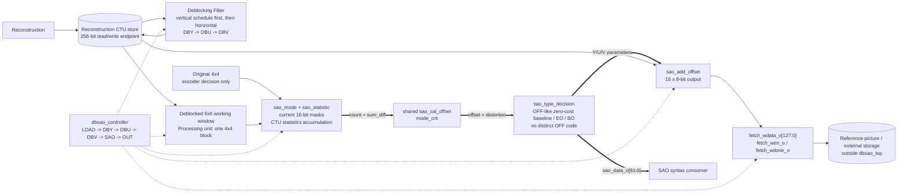

# `dbsao_top` RTL Architecture

This document is derived from the Verilog modules in this directory. The
architectural boundary is `dbsao_top`; blocks outside that boundary are shown
only as endpoints of declared `dbsao_top` ports. A box marked **functional** is
a scheduling/data-movement function inside an RTL module, not another module.

## RTL constraints that affect the diagram

| Requested concept | What is present in this RTL |
|---|---|
| Boundary-strength input | There is no `bs_i` port. `db_bs` derives `tu_edge_w`, `pu_edge_w`, `qp_p_w`, `qp_q_w`, `cbf_p_w`, and `cbf_q_w`; `db_filter` derives its local two-bit `bs_w`. |
| External Y/U/V select input | There is no component-select input on `dbsao_top`. `dbsao_datapath` generates `rec_sel_o`, `ori_sel_o`, `fetch_wsel_o`, and `sao_sel_o` from the controller phase and its internal counters. Values are Y=`2'b00`, U=`2'b10`, and V=`2'b11`. |
| Internal deblocked CTU RAM | No CTU RAM is instantiated in this folder. DBF reads and writes an external reconstruction-buffer endpoint through `rec_rd_*` and `rec_wr_*`; SAO rereads the deblocked samples through the same read endpoint. |
| Separate vertical/horizontal filter modules | There is one `db_filter` instance. `dbsao_datapath` schedules vertical work first (`is_ver_o=1`) and feeds the results through `block[0:7]` into later horizontal work (`is_ver_o=0`). |
| SAO OFF encoding | `sao_type_decision` initializes `min_cost`, offsets, type, and subtype to zero. A candidate replaces that baseline only when its cost is negative. This is an OFF-like zero-cost/zero-offset baseline, but there is no separately encoded OFF candidate; the zero type value is also the RTL's EO_0 type code. |
| Decision-valid output | `sao_type_decision` has no valid output. `td_data_valid` is internal to `sao_top`; Y/U/V parameter registers latch when the delayed `mode_cnt` reaches 24. |
| `Clip(rec + offset)` in SAO | `sao_add_offset` performs a signed 9-bit addition but writes `rec_w_xx[7:0]`. There is no explicit saturating clip module or comparison in this SAO output path, so the diagram does not label this as `Clip`. |
| Output memory protocol | `dbsao_top` exposes the fetch-side write interface only. The external-memory protocol and the reference-picture RAM module are outside this folder and their widths/protocols cannot be inferred beyond these declared ports. |

## Complete architectural block diagram

Solid arrows carry pixels. Dashed arrows carry control. Thick arrows carry
accumulated statistics or selected SAO parameters.

```mermaid
flowchart LR
  subgraph INPUT[Input and reconstruction interface]
    REC_STAGE["Reconstruction / inverse-transform stage<br/>(outside dbsao_top)"]
    REC_STORE[("Reconstruction CTU store<br/>outside dbsao_top<br/>rec_rd_pxl_i 256 bits<br/>rec_wr_pxl_o 256 bits")]
    ORI_STORE[("Original-pixel store<br/>outside dbsao_top<br/>ori_pxl_i 256 bits")]
    TOP_STORE[("Top-neighbor store<br/>outside dbsao_top<br/>top_rdata_i 32 bits / 4 pixels")]
    META["CTU metadata<br/>rc_qp_i[5:0], IinP_flag_i[2:0]<br/>mb_type_i, mb_partition_i[20:0]<br/>mb_p_pu_mode_i[41:0], mb_cbf_*[255:0]"]
    MVSTORE[("Motion-vector RAM endpoint<br/>mb_mv_rdata_i[19:0]")]
  end

  subgraph DBF[Deblocking Filter]
    DP_DB["dbsao_datapath: DB scheduling<br/>rec addresses, component select<br/>top/left/top-left selection"]
    BOUNDARY[("Local boundary registers<br/>top_y_r[0:15], top_u/v_r[0:7]<br/>left_y_r[0:15], left_u/v_r[0:7]<br/>top-left and right-edge registers")]
    BSMETA["db_bs<br/>db_tu_edge + db_pu_edge + db_qp<br/>TU/PU edge, QP, CBF context"]
    MVMETA["db_mv<br/>current/top/left MV context"]
    VPH["Vertical-edge schedule (functional)<br/>first passes: is_ver_o = 1"]
    MAP["db_filter pixel unpack/orientation<br/>four lanes of p3,p2,p1,p0 | q0,q1,q2,q3<br/>p_i[127:0] + q_i[127:0]"]
    DEC["Boundary/filter decision in db_filter<br/>bs_w, beta_w, tc_w<br/>normal / strong / chroma / bypass"]
    FILT["Instantiated filter arithmetic<br/>db_normal_filter<br/>db_strong_filter + db_clip3_str<br/>db_chroma_filter"]
    FB[("dbsao_datapath block[0:7]<br/>128 bits each<br/>vertical-result feedback")]
    HPH["Horizontal-edge schedule (functional)<br/>later passes: is_ver_o = 0"]
    DBASM["DB output assembly<br/>rec_pxl_o_r[255:0]"]
  end

  subgraph BUF[DBF-SAO buffering]
    DBSTORE[("Deblocked-pixel store<br/>same external reconstruction CTU store<br/>DBF writes in place; SAO/OUT reread")]
    SAOWIN[("dbsao_datapath SAO working storage<br/>16 x 64-bit reconstructed line registers<br/>16 x 32-bit original line registers<br/>6x6 reconstructed window + current 4x4 original")]
  end

  subgraph CLASS[SAO classification and statistics]
    BOPRE["sao_bo_predecision<br/>pre_bo_rec_o[255:0] -> bo_predecision[14:0]<br/>five-bit first BO band per Y/U/V"]
    MODE["sao_mode<br/>EO_0, EO_45, EO_90, EO_135<br/>BO_0..BO_7 around bo_predecision"]
    MASKNOTE["Current SAO mask: 16 bits per class<br/>one bit per pixel in current 4x4<br/>1 means pixel belongs to that class<br/>Masks are not stored for the complete CTU"]
    STAT["sao_statistic<br/>24 x sao_sum_diff instances<br/>per-block count and sum(original-reconstructed)"]
    ACC[("Per-component accumulated statistics<br/>count: 12 bits/class<br/>sum_diff: signed 18 bits/class<br/>Statistics are accumulated across the CTU")]
  end

  subgraph DECISION[SAO mode decision]
    MCNT["mode_cnt 0..23 (functional in sao_top)<br/>serially selects 16 EO + 8 BO classes"]
    CAL["one reused sao_cal_offset<br/>signed offset[2:0], distortion[19:0]<br/>magnitude quantized to 0..3<br/>D = count*offset^2 - 2*offset*sum_diff"]
    TDEC["sao_type_decision<br/>OFF-like baseline cost = 0, zero offsets<br/>no distinct OFF code; type 0 is also EO_0<br/>EO_0 / EO_45 / EO_90 / EO_135 / BO<br/>cost = sum(D) + 15*sum(abs(offset))"]
    PARAM[("Y/U/V parameter registers in sao_top<br/>type[2:0], subtype[4:0]<br/>four signed 3-bit offsets = 12 bits")]
    DECNOTE["SAO decision unit: one CTU/component<br/>Decoder only needs signaled type, subtype, and offsets"]
  end

  subgraph OUTPUT[SAO filtering and output]
    APPLY["sao_add_offset<br/>select one of four class masks per pixel<br/>RTL: signed reconstructed + offset<br/>output takes low 8 bits; no explicit Clip"]
    SAOBLK["sao_block_o[127:0]<br/>16 pixels x 8 bits"]
    OUTASM["dbsao_datapath output assembly<br/>fetch address/component generation<br/>fetch_wr_ena_w / fetch_wr_done_w"]
    FETCHIF["dbsao_top fetch write interface<br/>fetch_wdata_o[127:0], fetch_wen_o<br/>fetch_w4x4_x/y_o[4:0], fetch_wsel_o[1:0]<br/>fetch_wprevious_o, fetch_wdone_o"]
    REFSTORE[("Fetch-side / reference-picture storage<br/>outside dbsao_top<br/>width/protocol beyond fetch ports: width to be verified")]
    SYNTAX["SAO syntax interface<br/>sao_data_o[61:0]<br/>{2'b00, Y params, U params, V params}"]
  end

  subgraph CONTROL[Control path]
    SYS["clk, rst_n, sys_start_i<br/>sys_db_ena_i, sys_sao_ena_i<br/>sys_ctu_x_i, sys_ctu_y_i"]
    CTRL["dbsao_controller<br/>IDLE -> LOAD -> DBY -> DBU -> DBV -> SAO -> OUT<br/>terminal counts: 128,263,71,71,451,455"]
    DERIVED["Control decode in dbsao_datapath (functional)<br/>buffer read/write, component selection<br/>4x4 coordinates, is_ver_o<br/>fetch valid/write/done"]
    DONE["sys_done_o"]
  end

  NOTE4["Processing unit: one 4x4 block<br/>Luma CTU: 16x16 = 256 logical 4x4 blocks<br/>Chroma U/V: 8x8 = 64 logical blocks each"]
  NOTEORI["Encoder uses original pixels only for SAO decision"]
  NOTEBUF["Deblocked pixels are buffered until SAO parameters are available"]

  REC_STAGE --> REC_STORE
  REC_STORE -->|"rec_rd_pxl_i[255:0]"| DP_DB
  TOP_STORE -->|"top_rdata_i[31:0]"| BOUNDARY
  BOUNDARY --> DP_DB
  META --> BSMETA
  MVSTORE --> MVMETA
  BSMETA -.->|"tu_edge_w, pu_edge_w, qp_p/q_w, cbf_p/q_w"| DEC
  MVMETA -.->|"mv_p_w, mv_q_w"| DEC
  DP_DB -->|"dbf_p_o[127:0], dbf_q_o[127:0]"| VPH
  VPH --> MAP
  MAP --> DEC
  DEC --> FILT
  FILT -->|"is_ver_o=1: dbf_p_i/q_i[127:0]"| FB
  FB --> HPH
  HPH --> MAP
  FILT -->|"is_ver_o=0: final horizontal result"| DBASM
  DBASM -->|"rec_wr_pxl_o[255:0]"| REC_STORE
  DBASM -->|"pre_bo_rec_o[255:0]"| BOPRE

  REC_STORE --> DBSTORE
  DBSTORE -->|"SAO/OUT rec read, SIZE_04"| SAOWIN
  ORI_STORE -->|"ori_pxl_i[255:0], SAO phase only"| SAOWIN
  SAOWIN -->|"rec_line_i_0..5: 48 bits each"| MODE
  SAOWIN -->|"rec current 4x4 + ori_line_i_0..3: 32 bits each"| STAT
  BOPRE -.->|"bo_predecision"| MODE
  MODE -->|"24 current-block masks, 16 bits each"| STAT
  MODE --> MASKNOTE
  STAT ==>|"per-block count + sum_diff"| ACC
  ACC ==>|"one component at a time"| MCNT
  MCNT -.->|"mode_cnt_i[4:0]"| CAL
  ACC ==>|"stat_i[17:0], num_i[11:0]"| CAL
  CAL ==>|"four offsets/distortions collected per candidate"| TDEC
  TDEC ==>|"best type/subtype/four offsets"| PARAM
  PARAM --> DECNOTE

  DBSTORE -->|"reread in OUT"| SAOWIN
  SAOWIN --> APPLY
  MODE -->|"current EO/BO masks"| APPLY
  PARAM ==>|"selected component parameters"| APPLY
  APPLY --> SAOBLK
  SAOBLK --> OUTASM
  OUTASM --> FETCHIF
  FETCHIF --> REFSTORE
  PARAM ==>|"registered packed parameters"| SYNTAX

  SYS -.-> CTRL
  CTRL -.->|"state_w[2:0], cnt_w[8:0]"| DERIVED
  CTRL -.->|"state_w / cnt_w"| BSMETA
  CTRL -.->|"state_w / cnt_w"| MVMETA
  CTRL -.->|"state_w"| DEC
  CTRL -.->|"state_w / cnt_w"| BOPRE
  CTRL -.->|"state_w"| MODE
  CTRL -.->|"state_w"| STAT
  CTRL -.->|"state_w"| APPLY
  DERIVED -.-> DP_DB
  DERIVED -.-> SAOWIN
  DERIVED -.-> OUTASM
  CTRL -.-> DONE
  NOTE4 -.-> SAOWIN
  NOTEORI -.-> STAT
  NOTEBUF -.-> DBSTORE

  classDef endpoint fill:#f5f5f5,stroke:#555,color:#111;
  classDef control fill:#fff3cd,stroke:#8a6d00,color:#111;
  classDef note fill:#e8f4ea,stroke:#347a45,color:#111;
  class REC_STORE,ORI_STORE,TOP_STORE,MVSTORE,REFSTORE endpoint;
  class SYS,CTRL,DERIVED,DONE control;
  class NOTE4,NOTEORI,NOTEBUF,MASKNOTE,DECNOTE note;
```

## Simplified high-level dataflow

## Processing order and buffering

1. `LOAD` reads the top CTU boundary through `top_ren_o`, `top_r4x4_o`,
   `top_ridx_o`, and `top_rdata_i`. `dbsao_datapath` stores the returned samples
   in `top_y_r`, `top_u_r`, and `top_v_r`; left and top-left registers retain
   horizontal-neighbor context.
2. `DBY`, `DBU`, and `DBV` read reconstructed pixels with `rec_siz_o=SIZE_08`.
   The datapath produces 128-bit `p` and `q` groups. Within each scheduled group,
   `is_ver_o` selects vertical orientation first; `block[0:7]` retains those
   results for the subsequent horizontal orientation. The assembled 256-bit DBF
   result is written back through the reconstruction-buffer interface.
3. `SAO` and `OUT` use `rec_siz_o=SIZE_04`. The logical component grids are
   16x16 for 64x64 luma and 8x8 for each 32x32 4:2:0 chroma component. The RTL
   address generator also visits X/Y sentinel values 16 for Y and 8 for U/V to
   assemble right/bottom neighborhoods; these sentinel visits are not extra
   logical 4x4 blocks.
4. For the current logical block, the datapath assembles six 48-bit reconstructed
   lines, which form the 6x6 neighborhood consumed by `sao_mode`, and four
   32-bit original lines. Each EO/BO class mask is 16 bits and exists only in
   the current combinational/pipeline path. `sao_statistic` retains accumulated
   counts and differences, not a CTU-wide mask array.
5. The statistic registers are cleared at the first coordinate of a component
   and accumulated while `state_i==SAO`. The snapshot used for decision is
   taken at delayed coordinates (14,14) for Y and (6,6) for U/V because the
   window/statistic pipeline is ahead of the trailing sentinel reads.
6. `mode_cnt` serializes 24 classes through one `sao_cal_offset`: 16 EO classes
   at counts 0..15, then eight BO classes at counts 16..23. Four consecutive
   offsets/distortions are grouped into each EO candidate; BO candidates are
   evaluated as sliding groups ending at counts 19..23.
7. `sao_type_decision` compares candidate cost against the OFF-like zero-cost
   and zero-offset baseline; the RTL does not provide a distinct OFF type code.
   The selected parameters are stored independently for Y, U, and V. The Y and
   U registers latch in `SAO`; the V register latches as the pipeline enters
   `OUT`.
8. `OUT` rereads the same deblocked reconstruction store. `sao_mode` regenerates
   masks for the current window, and `sao_add_offset` applies the stored
   component parameters. `dbsao_datapath` assembles 128-bit writes and drives
   `fetch_wen_o`; `fetch_wdone_o` pulses after the final V block.

## Block explanations

- **`dbsao_controller`**: one fixed-latency CTU controller. It exposes only
  `state_o`, `cnt_o`, and `done_o`; detailed enables and addresses are decoded in
  the consumers.
- **`dbsao_datapath`**: owns reconstruction/original/top-buffer addressing,
  component traversal, top/left context, DBF block reorientation and feedback,
  SAO 6x6-window construction, output assembly, and all `fetch_w*` qualifiers.
- **DB metadata path**: `db_bs` builds TU/PU edge, CBF, and QP context; `db_mv`
  supplies p/q motion vectors. `db_filter` combines them to derive `bs_w`, beta,
  and tc.
- **`db_filter`**: one combinational filter datapath used for both orientations.
  It unpacks four p/q sample lanes, selects luma normal/strong filtering, intra
  chroma filtering, or bypass, and repacks two 128-bit outputs.
- **`sao_bo_predecision`**: accumulates five-bit band values during DBY/DBU/DBV
  and supplies one five-bit BO base band for each component.
- **`sao_mode`**: classifies the current reconstructed 4x4 using its 6x6
  neighborhood. It emits four 16-bit masks for every EO direction and eight
  16-bit BO masks relative to the BO predecision.
- **`sao_statistic`**: calculates the current block's selected-pixel count and
  `sum_diff = sum(original_pixel - reconstructed_pixel)` using 24
  `sao_sum_diff` instances, then accumulates 12-bit counts and signed 18-bit
  differences for the current component.
- **`sao_cal_offset`**: shared serial calculator. It quantizes
  `abs(sum_diff)/count` by thresholds at `count`, `2*count`, and `3*count`,
  limits magnitude to 0..3, applies EO sign restrictions, and computes
  `count*offset^2 - 2*offset*sum_diff`.
- **`sao_type_decision`**: groups four class results and evaluates
  `sum(distortion) + 15*sum(abs(offset))`. Negative-cost candidates replace the
  OFF-like zero-cost baseline. It returns type, subtype/BO starting band, and four
  signed three-bit offsets; it does not return a valid signal.
- **Y/U/V parameter registers**: registers inside `sao_top`, not a separate RTL
  module. They preserve the chosen type, subtype, and offsets while `OUT`
  rereads pixels.
- **`sao_add_offset`**: selects the per-pixel offset from four masks and emits a
  128-bit block. The present RTL takes the low eight bits of each signed sum and
  does not implement explicit saturation clipping.
- **Output/reference endpoint**: `dbsao_top` provides a 128-bit fetch-side write
  interface, a write enable, coordinates, component select, previous-buffer
  select, and completion. The actual reference-memory module is not instantiated
  in this folder.

## Module table

| Module name | Main inputs | Main outputs | Function |
|---|---|---|---|
| `dbsao_top` | System control, CTU metadata, MV data, reconstructed/original/top pixels | Reconstruction read/write controls, fetch writes, `sao_data_o`, `sys_done_o` | Top-level DBF+SAO integration. |
| `dbsao_controller` | `clk`, `rst_n`, `start_i` | `state_o[2:0]`, `cnt_o[8:0]`, `done_o` | Fixed `IDLE/LOAD/DBY/DBU/DBV/SAO/OUT` schedule. |
| `dbsao_datapath` | State/count, CTU coordinates, reconstructed/original/top pixels, filtered p/q, `sao_block_i` | RAM addresses/enables, p/q blocks, SAO windows, fetch writes | Addressing, buffering, orientation schedule, and output assembly. |
| `db_bs` | Partition data, `mb_cbf_*`, QP, CTU position, state/count | `tu_edge_o`, `pu_edge_o`, `qp_p/q_o`, `cbf_p/q_o` | Produces DB edge/QP/CBF context; contains `db_tu_edge`, `db_pu_edge`, `db_qp`, and context RAMs. |
| `db_tu_edge` | `mb_partition_i` | Vertical/horizontal TU-edge vectors | Expands the CTU partition tree into TU boundary flags. |
| `db_pu_edge` | `mb_partition_i`, `mb_p_pu_mode_i` | Vertical/horizontal PU-edge vectors | Expands partition and PU modes into PU boundary flags. |
| `db_qp` | Per-4x4 Y/U/V CBF and left QP flag | `qp_flag_o` | Propagates the QP-modification flag through zero-CBF 4x4 units. |
| `db_mv` | State/count, CTU coordinates, `mb_mv_rdata_i[19:0]` | MV RAM control, `mv_p_o[19:0]`, `mv_q_o[19:0]` | Aligns current/top/left motion-vector context to each DB edge. |
| `db_filter` | `p_i/q_i[127:0]`, MV, TU/PU edge, QP, CBF, orientation, enable | `p_o/q_o[127:0]` | Derives boundary strength and selects luma/chroma filtering or bypass. |
| `db_lut_beta` | QP | `beta_o[6:0]` | QP-to-beta threshold lookup. |
| `db_lut_tc` | QP, edge type | `tc_o[4:0]` | QP/edge-type-to-tc threshold lookup. |
| `db_normal_filter` | Four lanes of p/q samples and `tc_i` | Normally filtered p/q samples and edge-valid flags | Luma normal-filter arithmetic and clipping. |
| `db_strong_filter` | Four lanes of p/q samples and `tc_i` | Strongly filtered p/q samples | Luma strong-filter arithmetic; instantiates `db_clip3_str`. |
| `db_clip3_str` | Input sample and lower/upper limits | Clipped sample | Three-way clip used by the strong DB filter, not by SAO. |
| `db_chroma_filter` | Four lanes of p0/p1/q0/q1 and `tc_i` | Filtered p0/q0 | Intra chroma edge filtering with 0..255 saturation. |
| `sao_bo_predecision` | DBF writeback blocks, state/count | `bo_predecision_o[14:0]` | Chooses an eight-band BO search base independently for Y/U/V. |
| `sao_top` | State/enable, BO base, coordinates/component, 6 rec lines, 4 original lines | `sao_block_o[127:0]`, `sao_data_o[61:0]` | Integrates SAO classification, statistics, decision, registers, and application. |
| `sao_mode` | Current 6x6 reconstructed window, position/component, BO base | 16 EO masks + 8 BO masks, each 16 bits | Current-4x4 EO/BO classification. |
| `sao_statistic` | Four reconstructed lines, four original lines, 24 masks | Per-class 12-bit counts and signed 18-bit differences | Per-block reduction and per-component CTU accumulation. |
| `sao_sum_diff` | One 16-bit mask and sixteen signed six-bit differences | `num_sum[3:0]`, `diff_sum[9:0]` | Combinational count and masked sum for one class. |
| `sao_cal_offset` | `stat_i[17:0]`, `num_i[11:0]`, `mode_cnt_i`, valid | Signed `offset_o[2:0]`, signed `distortion_o[19:0]` | Shared quantized offset and distortion calculation. |
| `sao_type_decision` | Four offsets, four distortions, `mode_cnt_i`, BO base, valid | `type_o[2:0]`, `sub_type_o[4:0]`, `offset_o[11:0]` | Cost comparison against implicit zero-cost baseline. |
| `sao_add_offset` | Reconstructed window, current masks, Y/U/V parameters | `rec_sao_o[127:0]` | Per-pixel class offset selection, signed addition, and block assembly. |

## Confirmed top-level interface widths

| Interface | Confirmed signals and widths | Use |
|---|---|---|
| Reconstruction read | `rec_rd_pxl_i[255:0]`, X/Y `[3:0]`, index `[4:0]`, enable, select `[1:0]`, size `[1:0]` | DBF input and SAO/OUT reread. |
| Reconstruction write | `rec_wr_pxl_o[255:0]` with matching address/select/size and `rec_wr_wen_o` | In-place DBF writeback only. |
| Original read | `ori_pxl_i[255:0]` with X/Y/index/select/size and `ori_ren_o` | Encoder-side SAO statistics during `SAO`. |
| Top-neighbor read | `top_rdata_i[31:0]`, `top_ren_o`, `top_r4x4_o[4:0]`, `top_ridx_o[1:0]` | Four-pixel top boundary load. |
| MV read | `mb_mv_rdata_i[19:0]`, `mb_mv_ren_o`, `mb_mv_raddr_o[5:0]` | DB boundary-strength decision. `mb_mv_ren_o` is documented low-active in the top-level RTL. |
| Fetch write | `fetch_wdata_o[127:0]`, `fetch_wen_o`, X/Y `[4:0]`, previous/done, select `[1:0]` | Final samples and DB boundary patches to the external fetch-side store. |
| SAO syntax | `sao_data_o[61:0]` | Two zero merge bits plus 20 bits each for Y, U, and V. |
| Completion | `sys_done_o` | One registered completion pulse when `OUT` transitions to `IDLE`. |

## Source anchors

- `dbsao_top.v`: ports and widths at lines 22-168; hierarchy at 273-448.
- `dbsao_controller.v`: state encodings and terminal counts at 50-63; state
  transitions at 83-128.
- `dbsao_datapath.v`: DB read/write schedule at 263-359; boundary/block feedback
  at 370-612; SAO traversal and windows at 633-1114; output controls at
  1121-1379.
- `db_filter.v`: p/q layout at 167-221; strength/filter decision at 120-165 and
  302-317; instantiated filters and output selection at 344-590.
- `sao_top.v`: masks/statistics wiring at 83-307; shared `mode_cnt` calculator
  and decision at 311-492; Y/U/V registers and outputs at 494-603.
- `sao_mode.v`: current-block mask generation at 133-442.
- `sao_statistic.v`: original-minus-reconstructed differences at 335-350;
  `sao_sum_diff` instances at 572-810; CTU accumulation at 812-1070.
- `sao_cal_offset.v`: quantization/sign limits and distortion at 77-116.
- `sao_type_decision.v`: cost and implicit baseline comparison at 121-205.
- `sao_add_offset.v`: parameter/mask selection at 137-243 and pixel addition/
  output construction at 245-390.
