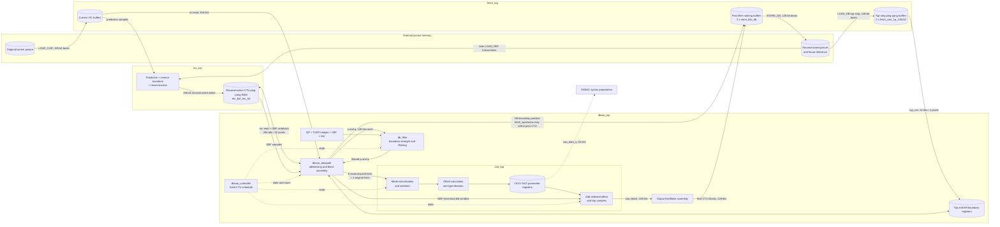
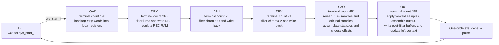
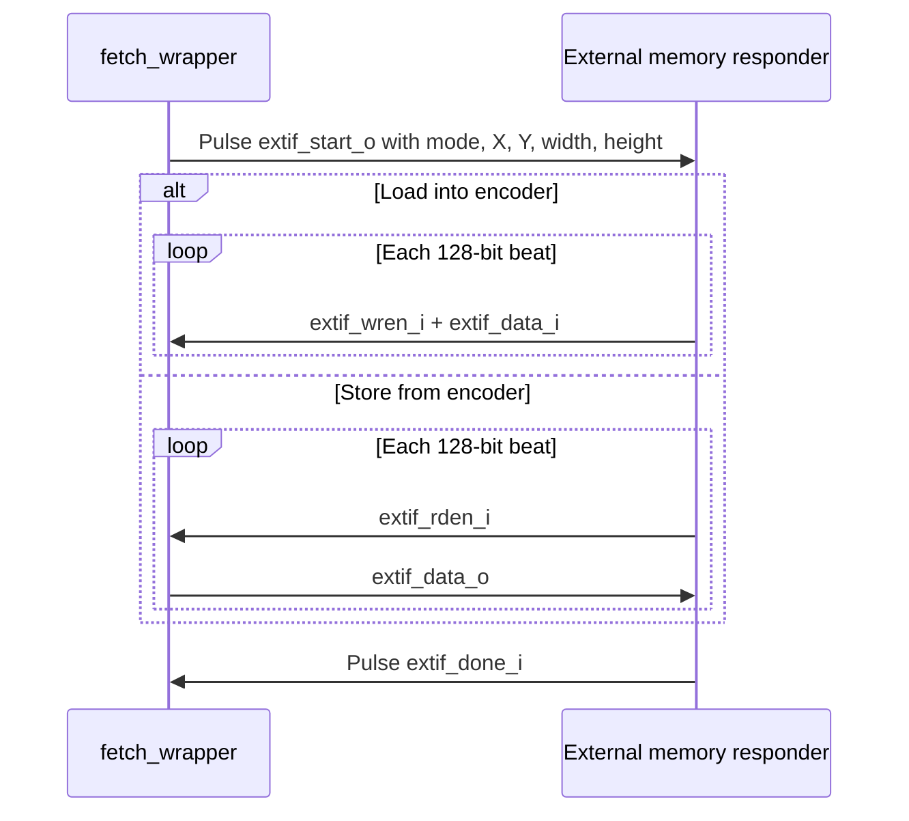

# In-Loop Filter Block Diagram (DBF + SAO)

This document describes the implemented xk265 in-loop-filter datapath. It is
based on the RTL around `dbsao_top`, not on a generic HEVC encoder diagram.
The design operates on one 64x64 luma CTU plus its 4:2:0 chroma components.

The most important storage rule is:

> DBF modifies the reconstructed CTU in the reconstruction RAM. SAO then reads
> those DBF samples, combines them with original samples to select offsets, and
> sends the final samples to the fetch-side post-filter buffers. SAO output is
> not written back into the reconstruction CTU RAM.

## 1. Architecture and storage

There are three distinct sample stores around the filter:

| Storage | RTL implementation | Contents and lifetime | Access from DBF/SAO |
|---|---|---|---|
| Current-picture buffers | Luma/chroma buffers in `fetch_top` | Original input samples for the active pipeline slot | SAO reads these through `ori_*` while accumulating original-minus-reconstructed statistics. |
| Reconstruction CTU RAM | `rec_buf_rec_rot`, containing two rotating `rec_buf_rec` instances | Unfiltered reconstruction from `rec_top`, then the in-place DBF result | DBF reads and writes it through the 256-bit `rec_*` port. SAO rereads it but does not store its final result here. |
| Top-strip load buffers | Two `fetch_ram_1p_128x32` instances in `fetch_db` | Filtered bottom strip loaded from the CTU row above; the buffers rotate with pipeline slots | The `LOAD` state copies four-pixel words into `top_y_r`, `top_u_r`, and `top_v_r`. |
| Local boundary registers | `top_y_r[0:15]`, `top_u_r[0:7]`, `top_v_r[0:7]`, matching left arrays, and top-left registers in `dbsao_datapath` | Immediate top, left, and top-left neighbors needed across CTU edges | DBF block assembly selects these registers when filtering the first row or first column. Left registers are refreshed from final output for the next CTU in the row. |
| Datapath working registers | DBF `block[0:7]`, right-edge registers, SAO line windows, and output assembly registers | Short-lived 4x4/8x8 neighborhoods and alignment delays | They hide RAM latency and convert between 256-bit RAM blocks, 128-bit DBF halves, and SAO line windows. |
| Post-filter rotating buffers | Three `mem_bilo_db` instances in `fetch_db`; each is banked with four `fetch_ram_2p_64x208` memories | Completed samples plus delayed boundary corrections waiting for an external store transaction | DBY/DBU/DBV can patch boundary data; `OUT` writes the final SAO/no-SAO CTU. Triple rotation permits one CTU to be filled while an earlier CTU is stored. |
| External reconstructed picture | Memory behind the top-level `extif_*` port | Persistent filtered picture, including the overlap strips required by the next CTU row | It supplies later `LOAD_DB` top strips and can be loaded as a reference picture for inter prediction. |

The double and triple buffers belong to different stages. The two
reconstruction buffers decouple reconstruction from DBF/SAO. The three
post-filter buffers decouple DBF/SAO completion from delayed external stores
and boundary corrections.

## 2. CTU phase and data movement

`dbsao_controller` advances on fixed terminal counter values. The labels below
show the terminal `cnt_o` value, not a ready/valid transaction count.

The data movement for one CTU is:

1. Before filtering, `rec_top` has produced the reconstructed CTU in one side
   of `rec_buf_rec_rot`. In parallel, `fetch_top` holds the original CTU, and
   `LOAD_DB_LUMA/CHROMA` transactions have prefetched the bottom strip of the
   CTU above when `ctu_y != 0`.
2. `LOAD` reads the top-strip ping-pong buffer through `top_ren_o`,
   `top_r4x4_o`, and `top_ridx_o`. The returned 32-bit word contains four
   pixels and is accumulated into 128-bit top-boundary registers.
3. `DBY`, `DBU`, and `DBV` read 256-bit reconstructed blocks. The datapath
   combines them with top/left context and presents 128-bit `p` and `q` sides
   to `db_filter`. Filtered blocks are assembled and written back to the same
   reconstruction CTU buffer. QP, CU/TU/PU boundaries, CBF flags, and motion
   vectors determine the boundary strength and filter thresholds.
4. While DBF writes completed rows, the datapath also accumulates the band
   predecision data and sends corrected cross-CTU boundary samples to the
   post-filter buffer. `fetch_wprevious_o=1` redirects a write to the prior
   rotating CTU slot when a shared boundary changed after that CTU was first
   produced.
5. `SAO` rereads the DBF result and the matching original pixels. The SAO
   logic classifies EO/BO candidates, accumulates count/difference statistics,
   calculates candidate offsets, and selects parameters independently for Y,
   U, and V. Some decision and output pipelines continue into `OUT`.
6. `OUT` applies the selected offset when SAO is enabled, or forwards the DBF
   sample when it is disabled. The datapath assembles 128-bit output blocks,
   writes them through `fetch_w*` into the current post-filter buffer, updates
   the local left boundary, and asserts `fetch_wdone_o` after the final V block.
7. The fetch controller drains a ready post-filter buffer with
   `STORE_DB_LUMA/CHROMA`. The stored picture is the persistent reconstruction
   used for top-strip reloads and future inter prediction.

### External overlap handling

The filter changes samples on CTU boundaries after neighboring samples become
available, so external stores include overlap rows:

| Transaction | Descriptor generated by `fetch_wrapper` |
|---|---|
| `LOAD_DB_LUMA` | 64x4 pixels starting at `ctu_y * 64 - 4` |
| `LOAD_DB_CHROMA` | 64x8 pixels starting at `ctu_y * 64 - 8` |
| First-row `STORE_DB_LUMA` | 64x64 pixels |
| Later-row `STORE_DB_LUMA` | 64x68 pixels, including the four-row luma overlap |
| First-row `STORE_DB_CHROMA` | 64x64 pixels |
| Later-row `STORE_DB_CHROMA` | 64x72 pixels, including the eight-row chroma overlap |

The store is intentionally delayed horizontally. The controller does not issue
the normal external store for `store_db_x == 0`, and the rotating buffers flush
the delayed CTU at the end of the row. This gives DBF time to finalize a shared
left/right boundary before the earlier CTU leaves the chip.

## 3. Transmission interfaces

Local RAM interfaces are scheduled interfaces: they do not expose `ready` or
backpressure. The fixed controller count and pipeline registers account for
their latency.

| Interface | Data width | Qualifiers/address | Meaning |
|---|---:|---|---|
| Reconstruction read | 256 bits (32 pixels) | `rec_rd_ren_o`, component `sel`, block `siz`, 4x4 X/Y, and line index | Read the current CTU for DBF or SAO. |
| Reconstruction write | 256 bits (32 pixels) | `rec_wr_wen_o` with the same address fields | Store DBF output back into reconstruction RAM. |
| Original read | 256 bits (32 pixels) | `ori_ren_o`, component, size, and 4x4 position | Supply original pixels to SAO statistics; asserted in the `SAO` phase. |
| Top-boundary read | 32 bits (4 pixels) | `top_ren_o`, 4x4 index, and word index | Load filtered samples from the CTU row above. |
| DBF internal pair | 2 x 128 bits | `p`, `q`, vertical/horizontal selection, and side information | Present both sides of one candidate boundary to `db_filter`. |
| Filter-to-fetch write | 128 bits (16 pixels) | `fetch_wen_o`, component, 4x4 X/Y, `fetch_wprevious_o`, `fetch_wdone_o` | Write boundary patches or final SAO output into a rotating post-filter buffer. |
| External memory beat | 128 bits (16 pixels) | Descriptor plus beat strobe and completion pulse | Load current/top/reference pixels or store filtered reconstruction. |
| SAO parameter path | 62 bits | `{merge flags, Y parameters, U parameters, V parameters}` | Send selected SAO syntax values toward CABAC. |

In the current `sao_top`, the two merge-flag bits at `sao_data_o[61:60]` are
driven to zero; the remaining 60 bits carry the Y, U, and V type, subtype, and
four three-bit offsets for each component.

The external beat handshake is directionally unusual and should not be
described as AXI:

There is no per-beat address on `extif_*`. The memory responder derives the
address from the descriptor and its beat counter. Within the filter-facing
interfaces, component values are `00` for Y, `10` for U, and `11` for V.

## 4. SAO sample/syntax integration warning

`sys_db_ena_i` cleanly selects filtered versus bypassed DBF samples while
retaining the fixed schedule. `sys_sao_ena_i` likewise controls the SAO
decision registers and sample modification in `sao_top`.

However, the reviewed build defines `SAO_OPEN` as `0` in `enc_defines.v`.
`sao_data_o` is still wired from `dbsao_top` to `cabac_top`, but CABAC bypasses
SAO syntax preparation under that compile-time setting. Therefore:

- Enabling only `sys_sao_ena_i` can modify the samples stored in external
  reconstruction memory.
- The emitted bitstream may still omit the syntax needed for a decoder to
  reproduce those modified samples.
- SAO must remain disabled for a conforming end-to-end build unless the CABAC
  syntax path and slice signalling are enabled and verified bit-exactly.

## 5. RTL source map

| Topic | Primary RTL |
|---|---|
| Top-level connections and filter side information | `dbsao_top.v` |
| State order and terminal counts | `dbsao_controller.v` |
| RAM addressing, boundary registers, block assembly, and fetch writes | `dbsao_datapath.v` |
| Deblocking decision and sample filtering | `db_filter.v`, `db_bs.v`, `db_mv.v` |
| SAO statistics, decision, parameters, and sample modification | `sao_top.v` and the `sao_*` modules |
| Reconstruction CTU ping-pong storage | `../rec/rec_wrapper/rec_buf_rec_rot.v` |
| Top-strip and post-filter rotating storage | `../fetch/fetch_db.v`, `../fetch/mem_bilo_db.v` |
| External transaction descriptors and beats | `../fetch/fetch_wrapper.v` |
| SAO syntax consumption | `../cabac/cabac_se_prepare.v`, `../enc_defines.v` |
